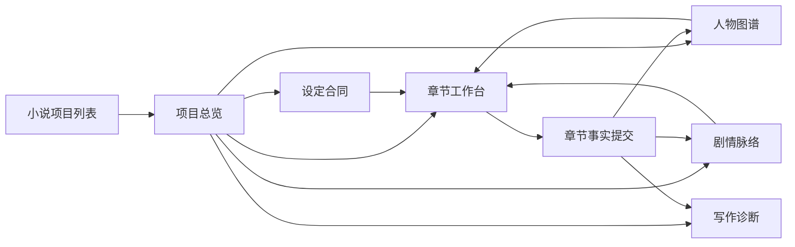
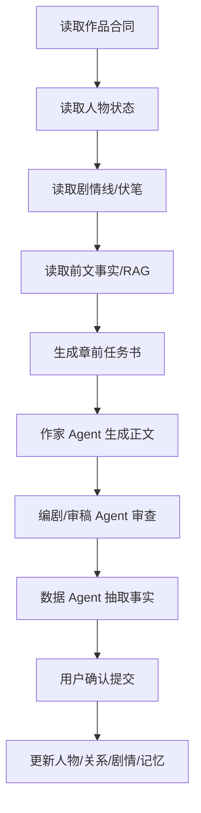

# AI 小说模块重构 PRD / 信息架构

> 日期：2026-06-19
> 范围：本地环境先行，不影响平台其他模块；AI 漫剧后续只从小说模块读取已沉淀的数据。

## 1. 背景与结论

参考竞品 `webnovel-writer` 和用户提供的视频素材后，AI 小说模块不能继续是“标题 -> 大纲 -> 章节”的轻量 Demo。长篇网文的核心矛盾不是写不出，而是记不住：设定、人物状态、人物关系、时间线、伏笔和章节事实必须被系统化保存，并在下一章生成前被显性使用。

当前模块的问题：

- 小说记录只有 `outline`、`chapters`、`story_bible` 雏形，缺少独立的作品合同和事实沉淀。
- 人物图谱来自一次大纲输出，不随章节演化；没有数据时容易误导用户以为系统已经理解人物关系。
- 章节生成没有章前任务书、审稿报告、事实提交、记忆更新闭环。
- RAG、知识库、写作 Agent、模型状态没有在界面暴露。
- 页面仍是旧三栏编辑器结构，无法支撑长篇项目管理。

## 2. 产品原则

1. 不展示假数据
   人物、关系、场景、伏笔必须来自小说大纲、章节正文或事实提交。没有数据时显示“缺少什么”和“下一步做什么”。

2. 小说是独立资产
   小说模块只读写小说自己的数据结构；漫剧模块后续通过导入小说读取，不反向污染小说或平台其他模块。

3. 生成前有任务书，生成后有审查和提交
   每章流程必须是：章前任务书 -> 生成正文 -> 审查 -> 修改 -> 提交事实 -> 更新记忆。

4. 模型状态要透明
   优先使用 Gemini / GPT-5.5 类长文能力模型；DeepSeek 只作为兜底。当前选择、兜底、RAG 是否启用都要显示。

5. 长篇一致性优先于一次生成速度
   生成内容必须读取作品合同、前文事实、人物状态、伏笔和时间线。

## 3. 信息架构



### 3.1 项目总览

展示：书名、题材、目标字数、当前卷/章、总字数、章节完成度、最近更新时间、模型/RAG/知识库/Agent 状态。

空状态：

- 未创建作品合同：提示“缺少设定合同，无法保证长篇一致性”。
- 未生成大纲：提示“缺少卷章规划，无法进入稳定写作”。
- 未提交章节事实：提示“章节已写但未沉淀事实，下一章可能遗忘前文”。

### 3.2 设定合同

字段：

- 基础合同：书名、题材、篇幅、目标字数、受众、卖点、风格。
- 世界观：时代/地点、力量体系、核心规则、禁区、代价、视觉气质。
- 主线承诺：核心冲突、长期目标、爽点机制、结局方向。
- 写作约束：禁写点、口吻、节奏、人物不崩规则。

行为：

- 可编辑保存。
- 可由 AI 初始化，但初始化失败必须报错，不写假合同。
- 合同变更要记录版本，后续用于检查设定冲突。

### 3.3 人物图谱

展示：

- 人物卡：姓名、别名、身份、目标、动机、弱点、当前状态、出场章节。
- 关系线：from、to、关系类型、张力、来源章节、最近变化。
- 关系历史：按章节显示“从敌对到合作”“误会加深”等演化。

规则：

- 人物必须来自大纲或章节事实抽取。
- 关系线两端必须能匹配到人物卡。
- 没有人物时显示“未从小说内容中提取人物”。
- 没有关系时显示“已有人物，但尚未提交关系事实”。

### 3.4 剧情脉络

展示：

- 主线、副线、感情线、成长线、反派线。
- 时间线：事件、章节、参与人物、影响。
- 伏笔追踪：埋设章节、状态、回收计划、超期提醒。

空状态：

- 未规划主线：提示“缺少剧情线，章节可能变成散点”。
- 有伏笔但未回收：标注风险，不自动假设已回收。

### 3.5 章节工作台

每章包含：

- 章前任务书：本章目标、冲突、出场人物、必须延续的事实、伏笔动作、结尾钩子。
- 正文编辑器：支持生成、续写、改写。
- 审查报告：OOC、设定冲突、时间线冲突、节奏、追读力。
- 事实提交：人物状态变化、关系变化、地点变化、关键事件、伏笔埋设/回收。

生成链路：



### 3.6 写作诊断

展示：

- 节奏：铺垫/冲突/转折/高潮比例。
- 追读力：本章钩子、冲突升级、下一章动力。
- 一致性：人物 OOC、世界观冲突、时间线冲突。
- 系统状态：模型、RAG、知识库、Agent 工作流、最近失败原因。

## 4. 数据模型

第一阶段仍写入当前 `outputs/novel_db.json` 的单部小说记录，避免影响其他模块；字段保持向后兼容。

```js
{
  contract: {
    logline, audience, target_words, genre, style,
    world: { setting, power_system, rules, taboos, cost, visual_style },
    promises: { core_conflict, long_goal, payoff, ending_direction },
    constraints: { voice, pacing, forbidden, continuity_rules },
    version, updated_at
  },
  entities: [
    { id, name, aliases, role, identity, goal, motivation, weakness, current_state, first_seen_chapter, last_seen_chapter, source }
  ],
  relationships: [
    { id, from, to, type, description, tension, status, source_chapter, history }
  ],
  plot_threads: [
    { id, type, title, status, chapters, description, stakes }
  ],
  foreshadows: [
    { id, setup_chapter, payoff_chapter, status, description, risk }
  ],
  chapter_briefs: [
    { chapter_index, goal, conflict, required_facts, characters, foreshadows, hook }
  ],
  chapter_commits: [
    { chapter_index, events, character_changes, relationship_changes, location_changes, foreshadow_updates, committed_at }
  ],
  review_reports: [
    { chapter_index, ooc, continuity, timeline, pacing, hook, issues, score, created_at }
  ],
  memory_items: [
    { id, type, text, source_chapter, importance, created_at }
  ],
  runtime_status: {
    model_provider, model_id, rag_enabled, kb_enabled, agent_workflow, last_error, updated_at
  }
}
```

第二阶段再评估迁移到 SQLite 业务表；迁移前必须有回滚脚本和生产备份，不在本阶段强行改库。

## 5. Agent 分工

- 作家 Agent：正文、文风、情绪、爽点。
- 编剧 Agent：结构、冲突、伏笔、章节目标。
- 导演 Agent：场景调度、画面感、动作/情绪节奏，为后续漫剧服务。
- 审稿 Agent：逻辑、OOC、设定一致性、时间线。
- 数据 Agent：从章节抽取事实、人物状态、关系变化、地点变化。
- 知识库/RAG：题材套路、桥段库、人物弧线、网文节奏、爆点模板。

## 6. 第一阶段交付范围

必须完成：

- 页面从旧三栏改为 6 个工作区导航。
- 所有模块只显示真实数据或明确缺失状态。
- 新建小说时创建 `contract/runtime_status/entities/relationships/...` 等结构。
- 大纲生成后同步真实人物、关系、场景、时间线到新结构。
- 章节生成后保存基础章节事实提交草稿，提示用户确认。
- 模型列表继续按 Gemini / GPT-5.5 优先，DeepSeek 兜底。

暂不完成：

- 不做生产部署。
- 不直接打通漫剧导入。
- 不强制迁移生产数据库。
- 不生成固定演示人物、固定关系图、固定剧情线。

## 7. 验收标准

- 新小说没有数据时，页面不会出现假人物、假关系、假伏笔。
- 旧小说能打开，并清楚显示缺少的长篇一致性数据。
- “人物图谱”里的每个节点都能追溯到 `entities` 或 `story_bible.characters`。
- “关系线”两端必须存在真实人物；否则不渲染并提示数据异常。
- 写作工作台仍能生成/编辑/保存章节。
- `node --check` 通过，首页 JS 不报语法错误。
- 不影响数字人、漫剧、图片/视频等其他模块入口。
