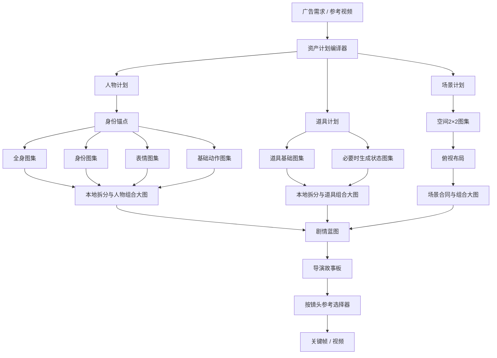

# VIDO 剧情广告：人物、道具、场景、参考识别与剧本链路统一优化方案

> 日期：2026-07-30
> 状态：代码改造与本地回归已完成；真实供应商全矩阵和生产发布待付费边界确认
> 适用范围：剧情广告六步导演工作流
> 核心目标：完整、快速、可恢复、可核对、不会因重试重复付费

---

## 0. 执行摘要

本方案解决五类已经确认的问题：

1. 普通 AI 人物与授权真人使用两套不同资产链路，前者仍是四视图，后者虽然有完整档案，但需要 17 次串行图片调用。
2. 当前没有独立道具视觉资产，只有动作合同中的接触文本和视频质检中的状态分数。
3. 场景已经采用“图集拆分 + 单独俯视布局”，但剧情状态、互动锚点和移动路线没有逐项进入场景图片生成与视觉验收。
4. 参考视频两组视觉证据串行读取；人物、道具、场景和文本阶段缺少统一的依赖调度与实际耗时统计。
5. 工作台默认展示方式仍偏向直接展开多图，没有统一的“单张封面 → 弹窗详情 → 按镜头选择高清参考”交互。

最终目标数据流：

```text
广告需求 / 参考视频
→ 一次结构化资产计划
→ 人物档案、道具档案、场景档案按依赖有限并发
→ 原子素材 + 本地组合大图 + 模型精简参考板
→ 剧情蓝图
→ 导演故事板
→ 按镜头选择人物、动作、道具、场景和商品参考
→ 关键帧 / 视频
→ 连续性质检与成片审核
```

核心工程决策：

- 人物不再逐张串行生成 17 次，改为 4 类高清图集，有限并发后本地拆成 17 项原子素材。
- 普通 AI 人物与授权真人共用同一份人物档案编译器，只在“身份锚点来源”上不同。
- 每个人物默认只显示一张组合档案封面；点击后才加载 17 项细节。
- 完整组合大图给人浏览、下载和交接；模型只使用当前镜头需要的少量高清参考。
- 道具成为独立一等资产，区分广告商品、穿戴配饰、剧情道具和场景固定物件。
- 场景保留“空间图集 → 俯视布局”的串行依赖，不为了表面并行破坏空间一致性。
- 所有付费调用按资产类别或镜头建立持久化检查点，失败只补缺失项。
- 任何供应商返回“已提交但账单未知”时停止自动重试，必须人工确认。

---

## 1. 目标与非目标

### 1.1 必须达到的目标

1. 人物、道具和场景均拥有结构化档案、视觉资产、版本、来源和验证状态。
2. 参考视频识别出的产品、空间、材质、人物功能、动作、道具、剧情和机位可以进入后续资产与剧本合同。
3. 普通 AI 人物与授权真人生成结果在档案结构和工作台显示上保持一致。
4. 人物完整档案不再要求 17 次串行图片调用。
5. 用户刷新页面、服务重启或供应商失败后，可以从检查点继续，不能重复已成功付费调用。
6. 工作台首屏只加载每个资产的一张缩略封面。
7. 用户可以查看完整组合大图，也可以进入分类查看高清原子素材。
8. 下游模型按镜头精确选择参考，不把全部大拼图无差别塞入模型。
9. 每个阶段展示真实进度、实际调用数、可恢复状态和费用边界。
10. 旧任务可读，不自动触发升级或付费生成。

### 1.2 本轮非目标

1. 不在参考视频中提取或复刻真人身份、脸、原片服装和私密属性。
2. 不把场景基础档案生成人物化；基础场景仍保持空场景。
3. 不为了减少一次调用而把身份、表情、动作和服装全部压入一张低清大拼图。
4. 不自动为每个镜头生成人物动作图；只对确实需要额外动作证据的镜头按需生成。
5. 不改变已经稳定的关键帧、视频、配音和合成费用确认原则。

---

## 2. 当前状态与确认事实

### 2.1 参考视频

当前流程：

```text
视频校验
→ 证据帧与音轨并行提取
→ 第1组4帧视觉读取
→ 第2组4帧视觉读取
→ 程序确定性编译剧情、场景、人物功能、动作、提示词和机位
→ 自动填入广告需求和结构化上下文
```

已确认：

- 两组视觉读取当前串行。
- 每组结果按源视频和帧指纹缓存。
- 重新整理已完成证据不会再次调用视觉模型。
- 参考人物只允许转换为原创角色功能和表演规律，不允许提取身份。
- 当前没有正式的 `prop_candidates` / `prop_states` 独立输出合同。

### 2.2 普通 AI 人物

当前流程：

```text
每个人物
→ 生成一张2×2四视图
→ 本地拆成正面、侧面、背面、动作
→ 视觉一致性校验
```

缺口：

- 没有身份近照组。
- 没有表情组。
- 没有服装细节组。
- 没有完整基础动作组。
- 与授权真人档案不一致。
- 多个人物当前逐个串行。

### 2.3 授权真人

当前流程：

```text
授权身份照片
→ 2个换装候选（2次图片调用）
→ 用户确认身份/服装锚点
→ 17项原子素材逐张串行生成（17次图片调用）
→ 3组视觉质检串行
→ Sharp 本地拼版
→ 用户确认
→ 分镜完成后逐镜串行动作三联图
```

缺口：

- 17次图片调用串行，耗时长。
- 原子素材在完整档案成功前没有逐项持久化检查点。
- 中途失败后虽然图片文件可能仍在，业务记录无法安全复用，重试可能重复调用。
- 剧情动作三联图逐镜串行，且失败前的完成项没有逐镜检查点。
- 普通人物不能复用这套完整档案。

### 2.4 道具

当前仅有：

- `prop_contact`：动作合同中的手部/道具接触文本。
- `prop_state`：视频连续性质检维度。

当前没有：

- 道具视觉资产。
- 道具多视图。
- 道具状态变体。
- 道具归属关系。
- 道具逐镜状态时间线。
- 道具默认卡片和详情弹窗。

### 2.5 场景

当前单空间流程：

```text
1次2×2空间图集
→ 本地拆出主视角、反打、交互、细节
→ 1次俯视布局生成
→ 布局角色验证
→ 五视图空间合同验证
```

已确认：

- 单空间正常路径为 2 次图片调用。
- 双空间正常路径为 4 次图片调用。
- 图集成功后可通过场景检查点复用，不必重复生成。
- 俯视布局依赖图集中的空间身份，不能与首个图集安全并行。
- `storyStates`、`interactionAnchors`、`routes` 已进入场景规划、上下文和导演工作台。
- 场景图片提示主要读取 `interactionText`，尚未逐项编译上述三个结构化数组。

### 2.6 剧情与故事板

当前主要依赖：

```text
资产/需求上下文
→ 剧情蓝图
→ 导演故事板
→ 关键帧合同
```

蓝图与故事板具有明确前后依赖，不能简单并行。可以优化的是：

- 需求未变时复用输入指纹和已完成输出。
- 参考视频已经提供完整证据时，减少重复理解调用。
- 人物、道具和场景的“规划文本”可以由一次资产计划统一输出。
- UI 可以增量展示已完成结果，不必等待所有区域同时完成。

---

## 3. 根因闭环

### 3.1 最早的结构性根因

人物能力是分阶段增加的：

- 普通 AI 人物最早按“四视图一致性演员包”实现。
- 授权真人后来新增“身份、服装、表情、动作”的完整档案。
- 两条链路没有收敛到统一领域模型。

因此，“人物档案”在 UI 上是同一个概念，在代码里却代表两种不同资产。

### 3.2 17次串行的根因

授权真人实现将每一项原子图片都视为独立高保真生成任务，以避免大拼图细节不足。该决策保证了细节，但没有增加“类别图集”这一中间层，也没有并发调度和逐项检查点。

### 3.3 道具缺失的根因

道具此前只作为：

- 人物动作的接触描述；
- 场景内的普通物件；
- 视频连续性评分项；

没有被定义为独立可版本化视觉资产，所以无法在人物、场景和镜头之间稳定复用。

### 3.4 场景结构未完全贯通的根因

`storyStates`、`interactionAnchors` 和 `routes` 是在场景五视图体系之后新增的。它们已经进入保存和展示层，但场景图片编译器仍以四个文本字段为主，没有消费完整结构化合同。

### 3.5 性能根因

1. 将“顺序一致”误等同于“全部串行”。
2. 缺少统一的依赖图和全局并发预算。
3. 人物和动作没有细粒度持久化检查点。
4. 首屏加载多图，而不是单封面懒加载。
5. 缺少按阶段实际耗时指标，用户只能看到近似进度。

---

## 4. 目标架构



### 4.1 三种图的职责

每类资产必须区分：

1. **原子素材**：高清、可单独引用、可单独验证和重生。
2. **组合大图**：本地确定性排版，供人浏览、下载和交接。
3. **模型参考板**：只保留当前生成最需要的少量视觉锚点。

禁止把组合大图直接当成所有模型调用的唯一参考。

---

## 5. 统一档案领域模型

### 5.1 通用档案

```json
{
  "dossier_id": "dossier_xxx",
  "task_id": "task_xxx",
  "asset_type": "person|prop|scene|pet",
  "asset_id": "stable_asset_id",
  "revision": 1,
  "schema_version": 1,
  "status": "planned|generating|partial|ready_for_qa|verified|rejected|approved|invalidated",
  "input_fingerprint": "sha256",
  "source_authority": "user_upload|authorized_identity|synthetic|reference_video_evidence",
  "atomic_assets": [],
  "category_atlases": [],
  "composite_sheet": {},
  "model_reference_board": {},
  "verification": {},
  "generation_checkpoint": {},
  "lineage": {},
  "created_at": "",
  "updated_at": ""
}
```

### 5.2 人物档案

每个人物固定输出 17 项：

| 分类 | 数量 | 内容 |
|---|---:|---|
| 全身 | 4 | 正面、3/4侧面、正侧面、背面 |
| 身份 | 4 | 正脸、3/4脸、侧脸、后发型 |
| 表情 | 6 | 中性、自然微笑、专注、疑惑、惊讶、放松认可 |
| 基础动作 | 3 | 自然站立、自然行走、商品/道具展示 |

人物档案附加字段：

```json
{
  "identity_anchor": {
    "source": "synthetic_anchor|authorized_source",
    "immutable_for_revision": true,
    "image_url": ""
  },
  "identity_contract": {},
  "wardrobe_contract": {},
  "appearance_contract": {},
  "linked_prop_ids": [],
  "shot_action_asset_ids": [],
  "production_usable_actor": false
}
```

### 5.3 道具档案

道具分类：

| 类型 | 归属 | 示例 | 处理方式 |
|---|---|---|---|
| 广告商品 | 商品合同 | 汽车、手机、饮料 | 使用最高权威商品素材，不降级为普通道具 |
| 穿戴配饰 | 人物 + 道具 | 眼镜、包、手表 | 外观纳入人物身份，同时保留独立道具 ID |
| 剧情道具 | 独立资产 | 杯子、钥匙、文件 | 独立多视图与状态时间线 |
| 场景固定物件 | 场景锚点 | 桌子、门、灯具 | 不重复生成道具档案，进入场景合同 |

剧情道具数据：

```json
{
  "prop_id": "prop_xxx",
  "name": "玻璃杯",
  "prop_type": "handheld",
  "quantity": 1,
  "owner_subject_id": "person_xxx",
  "home_scene_id": "scene_xxx",
  "appearance": {
    "material": "透明玻璃",
    "color": "无色",
    "scale": "350ml",
    "identity_cues": ["圆柱杯身", "单侧杯柄"]
  },
  "views": ["front", "side", "back", "detail"],
  "states": [
    {"id": "empty", "label": "空杯"},
    {"id": "filled", "label": "装有咖啡"}
  ],
  "contact_contract": {
    "allowed_hands": ["right"],
    "grip_points": ["杯柄"],
    "forbidden_contacts": ["穿模", "悬浮"]
  },
  "shot_timeline": [
    {"shot_index": 1, "state": "empty", "holder": "", "scene_zone": "table"},
    {"shot_index": 2, "state": "filled", "holder": "person_xxx", "scene_zone": "interaction"}
  ]
}
```

### 5.4 场景档案

场景继续保留五项视觉资产：

- `master`
- `reverse`
- `interaction`
- `detail`
- `layout`

新增强制编译字段：

```json
{
  "story_states": [],
  "interaction_anchors": [],
  "routes": [],
  "prop_placements": [],
  "state_variant_requirements": [],
  "base_scene_unoccupied": true
}
```

基础场景仍不生成人物。剧情状态只用于：

- 预留动作区和路线；
- 固定道具初始位置；
- 判断是否需要额外场景状态变体；
- 后续关键帧和视频连续性。

### 5.5 检查点

所有档案使用统一检查点语义：

```json
{
  "checkpoint_version": 1,
  "task_id": "",
  "asset_id": "",
  "candidate_revision": 1,
  "input_fingerprint": "",
  "status": "running|partial|ready_for_qa|complete|billing_unknown",
  "units": {
    "body_atlas": {
      "status": "succeeded",
      "attempts": 1,
      "submission_id": "",
      "provider_request_id": "",
      "billing_state": "confirmed",
      "output": {}
    }
  },
  "retry_budget": {
    "max_extra": 1,
    "used_extra": 0
  }
}
```

检查点必须在每次供应商成功返回后立即持久化，不能等完整档案结束才保存。

---

## 6. 人物生成优化

### 6.1 普通 AI 人物

流程：

```text
人物文本合同
→ 生成全身图集，同时建立合成身份锚点
→ 使用同一锚点生成身份、表情、基础动作图集
→ 本地拆分为17项
→ 分类质检
→ 本地组合大图
→ 人工确认
```

建议图片调用：

| 调用 | 输出 |
|---|---|
| 1 | 全身 2×2 图集 |
| 2 | 身份 2×2 图集 |
| 3 | 表情 3×2 图集 |
| 4 | 基础动作三联图或 2×2 图集 |

总计：每个人物正常路径 4 次图片调用。

### 6.2 授权真人

流程：

```text
授权身份源
→ 2个换装候选
→ 用户确认身份/服装锚点
→ 与普通 AI 人物共用四类图集编译器
→ 本地拆分17项
→ 来源身份、跨视图、服装和动作质检
→ 人工确认
```

正常路径：

- 换装候选：2次。
- 完整档案：4次。
- 总图片调用：6次，而不是当前 19 次。

### 6.3 人物组合大图

组合大图不调用模型。

建议规格：

- 主文件：2400×1800 PNG。
- 工作台缩略图：480px WebP。
- 弹窗预览：1200px WebP。
- 原子素材保留各自高清文件。
- 排版由版本化 `layout_manifest` 决定。

排版区域：

1. 人物名称、角色和版本。
2. 身份视图。
3. 全身视图。
4. 表情组。
5. 基础动作。
6. 服装、色板和材质摘要。
7. 关联道具缩略图与关系。
8. 验证状态，不在图片内展示供应商或敏感技术信息。

### 6.4 剧情动作资产

不再默认对全部镜头生成动作三联图。

仅以下镜头需要：

- 手持或操作关键商品；
- 精确手部接触；
- 复杂起始—关键—结束动作；
- 上一镜动作连续性无法由基础动作覆盖；
- 视觉质检明确要求动作参考。

每个动作三联图：

- 使用稳定 `shot_action_id`。
- 独立检查点。
- 独立费用确认。
- 完成后立即保存。
- 失败只重试当前镜头。

---

## 7. 道具生成优化

### 7.1 道具计划来源

道具只从以下权威来源产生：

1. 用户明确填写或上传。
2. 参考视频中清晰可见且与剧情有关的非身份道具。
3. 已确认剧情蓝图。
4. 已确认分镜。

模型不能凭行业模板自动添加无关道具。

### 7.2 生成策略

静态道具：

```text
1次2×2基础图集
→ 本地拆出正面、侧面、背面、细节
→ 1次视觉身份质检
```

有状态变化的道具：

```text
基础图集
→ 1次状态图集（最多4个关键状态）
→ 状态一致性质检
```

用户上传道具：

- 原图直接成为权威锚点。
- 只有在后续镜头确实需要其它视角时才生成补充图集。
- 不自动改颜色、材质、Logo 或结构。

### 7.3 道具组合大图

默认卡片只显示一张封面。

弹窗包括：

- 基础多视图。
- 材质与尺度。
- 状态变体。
- 所属人物与场景。
- 握持/接触位置。
- 逐镜状态时间线。

人物组合大图只显示关联道具摘要，不复制全部道具高清图。

---

## 8. 场景生成优化

### 8.1 保留现有两步依赖

同一空间：

```text
空间2×2图集
→ 本地拆4视图
→ 使用同一空间图集生成俯视布局
```

这两个图片调用不并行。原因：

- 俯视布局必须继承空间身份、材质、开口和固定物件。
- 并行生成会使两个调用各自发明空间。
- 历史问题已经证明俯视布局容易退化成普通高机位商业图。

### 8.2 可以并行的部分

- 不同独立空间可以有限并发 2。
- 同一空间完整五视图产生后，不相互依赖的视觉评分可以有限并发。
- 本地拆图、缩略图、组合大图可以并行执行。

### 8.3 结构化合同直接贯通

场景图片提示必须直接编译：

- `interactionAnchors`：可互动区域、商品展示区、接触位置。
- `routes`：起点、终点、方向、不可阻挡路径。
- `storyStates`：基础场景必须预留哪些会发生变化的物件和区域。
- `propPlacements`：道具初始位置、数量、朝向。

视觉 QA 必须逐项回传：

- 互动锚点覆盖率。
- 路线可见性与可通行性。
- 固定物件状态正确性。
- 道具初始位置正确性。
- 五视图空间身份一致性。

### 8.4 场景状态变体

只有发生明确可见变化时才生成状态变体，例如：

- 门打开/关闭。
- 灯开启/关闭。
- 桌面道具由无到有。
- 商品从包装内取出。

状态变体不能混入基础五视图默认调用。应在蓝图确认后按需生成，并单独计费、单独检查点。

---

## 9. 参考视频识别优化

### 9.1 两批视觉读取有限并发

当前两组4帧串行，目标改为并发上限2。

必要保护：

- 每组使用稳定 `batch_id`。
- 每组使用独立 `client_request_id`。
- 每组完成后立即写入固定槽位，不按数组长度推断进度。
- 并发写入通过单任务写锁合并。
- 任一批失败时保留另一批成功结果。
- 供应商账单未知时禁止自动补发。

### 9.2 新增道具证据

参考分析结果升级为：

```json
{
  "prop_candidates": [
    {
      "temporary_id": "reference_prop_1",
      "name": "可见道具",
      "appearance_evidence": [],
      "state_evidence": [],
      "human_contact_evidence": [],
      "shot_refs": [],
      "confidence": 0.0
    }
  ]
}
```

这些只作为“当前任务原创/通用道具计划”的证据，不提取品牌、版权图案或真人身份。

### 9.3 成功后不重复理解

参考分析有效且用户未改写需求时：

- 人物计划由结构化结果确定性投影。
- 场景计划由结构化结果确定性投影。
- 道具计划由证据候选投影并等待用户确认。
- 剧情蓝图可以继承已确认故事节拍，避免重新分析整段视频。

---

## 10. 文本与剧本提速

### 10.1 统一资产计划

无参考视频时，将原本分散的人物、场景和道具辅助规划合并为一次严格 JSON 输出：

```json
{
  "cast_profiles": [],
  "prop_plan": [],
  "scene_plan": {},
  "story_seed": {}
}
```

用户可以分别修改，但不再为同一广告需求重复调用三个规划模型。

### 10.2 保留必要的串行依赖

```text
资产计划
→ 人物/道具/场景确认
→ 剧情蓝图
→ 导演故事板
```

蓝图与故事板不能并行，因为故事板必须使用已确认的因果、人物、道具、场景和状态时间线。

### 10.3 指纹复用

每个文本阶段指纹至少包括：

- 当前内容版本。
- 广告需求。
- 参考分析 ID 和版本。
- 人物、道具、场景档案版本。
- 目标时长、镜头数和画幅。
- 用户剧情与表演要求。

指纹一致且结果完整时直接复用。

### 10.4 增量展示

- 资产计划完成后立即展示人物、道具和场景卡片。
- 蓝图完成后立即展示故事结构。
- 故事板分页产生后逐页展示。
- 不让工作台因为候选视频或重型人物模块未加载而等待。

---

## 11. 并发、调度与费用预算

### 11.1 默认并发预算

初始建议值，必须经过真实供应商压测后调整：

| 资源 | 每用户 | 每任务 | 说明 |
|---|---:|---:|---|
| 图片生成 | 2 | 2 | 避免供应商限流和大量同时计费 |
| 视觉 QA | 2 | 2 | 只在图片已经持久化后执行 |
| 文本模型 | 2 | 1/阶段 | 不并发执行有依赖的蓝图和故事板 |
| 视频生成 | 沿用现有费用门禁 | 沿用现有 | 本方案不扩大 |

### 11.2 可以并行

- 参考视频第1/2视觉批次。
- 同一人物身份锚点确定后的四类图集，限制同时2类。
- 不同人物，受全局图片并发2约束。
- 独立道具基础图集。
- 不同独立场景。
- 已生成图片的独立 QA 批次。
- 本地拆图、缩略图、组合排版。

### 11.3 必须串行

- 授权真人来源 → 换装候选 → 用户确认锚点。
- 合成人物首个身份锚点 → 其它人物类别图集。
- 场景图集 → 俯视布局。
- 资产确认 → 剧情蓝图 → 导演故事板。
- 道具基础身份 → 状态变体。
- 前一镜状态未确定时依赖该状态的复杂动作资产。

### 11.4 调度优先级

1. 已提交且账单状态待确认的任务。
2. 用户正在查看的当前资产。
3. 身份锚点与场景基础图集。
4. 档案补充图集。
5. QA。
6. 缩略图和组合大图。
7. 非当前页面的预加载任务。

---

## 12. 防重复付费与恢复

### 12.1 幂等键

每个付费单元使用：

```text
task_id
+ asset_id
+ asset_revision
+ category/view/state/shot
+ input_fingerprint
+ attempt_number
```

### 12.2 供应商状态

统一保存：

- `client_request_id`
- `provider_request_id`
- `provider_task_id`
- `provider_submission_state`
- `billing_state`
- `submitted_at`
- `completed_at`

### 12.3 重试规则

- 已成功：永不重发。
- 明确未提交：允许按预算重试。
- 明确失败且未计费：允许目标单元重试。
- 已提交但结果未知：停止，要求人工确认。
- 内容审核失败：不自动重试。
- 鉴权失败：更换凭证前不重试。
- 输入指纹变化：创建新 revision，不覆盖旧资产。

### 12.4 服务重启

重启后：

- 读取持久化检查点。
- 运行中但没有供应商任务 ID 的单元标记为可安全重试。
- 有供应商任务 ID 的单元先查询或等待供应商状态。
- 不根据内存 `Map` 单独判断是否可以重试。

---

## 13. 前端体验

### 13.1 第二步命名

由“人物与场景档案”调整为：

**人物、道具与场景档案**

### 13.2 默认卡片

每个人物、道具和场景默认只显示：

- 一张组合封面缩略图。
- 名称和类型。
- 版本。
- 生成/验证状态。
- 本轮调用数和是否可恢复。
- “查看档案”“重新生成当前类别”操作。

### 13.3 人物弹窗

页签：

- 完整档案。
- 身份。
- 全身。
- 表情。
- 服装。
- 基础动作。
- 剧情动作。
- 关联道具。
- 版本与验证。

### 13.4 道具弹窗

页签：

- 完整档案。
- 多视图。
- 材质与尺寸。
- 状态。
- 接触关系。
- 镜头时间线。
- 版本与验证。

### 13.5 场景弹窗

页签：

- 完整档案。
- 商业机位。
- 俯视布局。
- 互动锚点。
- 移动路线。
- 剧情状态。
- 道具位置。
- 版本与验证。

### 13.6 懒加载

- 首屏只加载封面缩略图。
- 弹窗打开后加载当前页签。
- 原图只在用户放大时加载。
- 多人物、多道具和多场景列表分页或虚拟化。
- 关闭弹窗释放大图 DOM 引用，但不丢失状态。

### 13.7 真实进度

进度不得使用纯时间模拟。

示例：

```text
人物档案 2/4 类图集已完成
当前：表情图集生成中
已保存：全身、身份
本轮图片调用：3/4
可安全恢复：是
```

---

## 14. 引用选择策略

下游图片/视频模型默认最多使用 4 张参考：

1. 人物身份/服装精简参考板。
2. 当前镜头动作或上一帧。
3. 当前场景机位。
4. 商品或关键道具。

优先级由镜头类型决定：

| 镜头 | 参考优先级 |
|---|---|
| 人物近景 | 身份 > 动作 > 场景 > 商品 |
| 全身动作 | 动作 > 身份/服装 > 场景 > 道具 |
| 商品特写 | 商品 > 道具状态 > 场景 > 人物 |
| 空场景 | 场景 > 道具位置 > 商品 |
| 复杂接触 | 动作 > 道具 > 身份 > 场景 |

完整17格人物大图只用于用户查看，不直接占用默认模型参考槽。

---

## 15. 版本与失效矩阵

| 修改内容 | 必须失效 | 保留 |
|---|---|---|
| 人物身份 | 该人物全部派生图、动作、使用该人物的关键帧 | 场景、其它人物、独立道具、剧本文本 |
| 人物服装 | 全身、动作、参考板、相关关键帧 | 身份源、场景、独立道具 |
| 人物表情 | 表情类与引用该表情的关键帧 | 全身、场景、剧本 |
| 道具外观 | 道具多视图、状态图、引用镜头 | 人物身份、无关场景 |
| 道具状态时间线 | 相关动作、关键帧、视频连续性 | 道具基础多视图 |
| 场景布局 | 五视图、机位、该场景关键帧 | 人物和独立道具身份 |
| 场景材质/光线 | 场景视图、相关关键帧 | 人物身份、剧本文本 |
| 剧情动作 | 故事板、动作资产、关键帧、视频 | 人物基础身份、场景基础档案 |
| 广告需求 | 按实际差异域计算 | 未受影响的已确认资产 |

失效只标记受影响资产，不立即删除历史文件。

---

## 16. 旧任务迁移

### 16.1 普通四视图人物

- 映射为 `legacy_four_view` 人物档案。
- 保留现有图片和验证结果。
- 默认显示旧档案封面。
- 标记“可升级完整档案”。
- 用户明确点击并确认费用前，不生成新增图集。

### 16.2 已有授权真人17项档案

- 直接映射到统一 `atomic_assets`。
- 复用已有组合大图。
- 不重新生成。
- 缺少检查点的历史任务标记为“历史已完成”，不尝试补写供应商提交状态。

### 16.3 现有场景 V7

- 保留五视图和检查点。
- 新增结构化剧情字段时只补数据合同。
- 不因新增字段自动重生场景。
- 用户选择“生成状态变体”时再产生新调用。

### 16.4 历史道具

- 从已确认故事板提取道具文本候选。
- 只创建 `unconfirmed` 计划，不自动生成图片。
- 用户逐项确认是否是商品、配饰、剧情道具或场景固定物件。

---

## 17. 防止代码冗余、双链路和加载退化

本次优化不允许继续在旧剧情广告大文件上叠加条件分支。功能正确与架构收敛必须在同一轮验收。

### 17.1 当前体量证据

| 文件 | 当前行数 | 当前问题 |
|---|---:|---|
| `public/js/new-story-ad-legacy-ui.js` | 6399 | 已贴近现有6400行上限，人物、场景、剧情、生成和事件绑定混合 |
| `src/services/newStoryAd/storyAdService.js` | 3799 | 多阶段编排、恢复和领域逻辑集中 |
| `src/services/newStoryAd/sceneAssetService.js` | 1816 | 提示编译、供应商调用、检查点、QA和投影混合 |
| `public/js/new-story-ad/scene-assets.js` | 1720 | 数据、渲染、交互、轮询和修复混合 |
| `src/routes/newStoryAd.js` | 1634 | 上传、人物、场景、剧本、媒体和管理路由集中 |
| `src/services/newStoryAd/personDossierService.js` | 961 | 来源、候选、生成、QA、拼版和动作混合 |
| `src/services/newStoryAd/subjectAssetBundleService.js` | 799 | 普通人物与宠物生成、验证、检查点混合 |

现有边界检查仅保证旧 UI 不超过 6400 行，无法阻止“每次功能新增都逼近上限”的退化。本轮必须把边界从“允许继续堆积”改为“旧文件只能减少”。

### 17.2 唯一权威调用路径

每种能力只允许一个写入路径：

| 能力 | 唯一权威服务 | 旧路径处理 |
|---|---|---|
| 人物完整档案 | `assetDossierService` + 人物编译器 | `subjectAssetBundleService` 不再直接生成四视图；`personDossierService` 只负责真人来源和锚点 |
| 道具档案 | `propAssetService` | 禁止继续把道具只写入人物动作或场景文本 |
| 场景档案 | 场景档案编排器 | 旧场景升级入口只做兼容投影，不拥有新生成逻辑 |
| 参考视频 | `referenceVideoAnalysisService` | 前端只提交、轮询和投影，不复制分析规则 |
| 剧情蓝图 | 蓝图用例服务 | 前端和旧 UI 不生成或修复业务 JSON |
| 模型参考选择 | `referenceSelectionService` | 人物、关键帧和视频模块不得各自复制参考排序 |
| 付费图片调用 | `mediaAdapter` | 领域服务不能直接创建供应商 SDK 客户端 |
| 持久化 | `storageService` + 检查点服务 | UI、路由和模型适配器不能直接改任务 JSON |

### 17.3 旧文件冻结规则

从实施阶段 B 开始：

1. `new-story-ad-legacy-ui.js` 只允许删除代码、转发到新模块或修复迁移阻塞，不允许新增业务实现。
2. `storyAdService.js` 只保留跨阶段用例编排；新领域逻辑必须进入独立服务。
3. `newStoryAd.js` 只保留路由装配和通用中间件；新接口进入分组路由模块。
4. 已迁移功能不得保留“新路径失败就调用旧路径”的静默回退。
5. 兼容层必须有删除阶段、测试和明确的旧任务范围，不能永久存在。
6. 新旧路径不得同时写同一个 `person_asset`、`scene_asset`、`prop_asset` 或阶段输出。

### 17.4 建议模块边界

后端：

```text
routes/newStoryAd/
├─ referenceRoutes.js
├─ dossierRoutes.js
├─ storyRoutes.js
├─ generationRoutes.js
└─ reviewRoutes.js

services/newStoryAd/dossiers/
├─ dossierOrchestrator.js
├─ personDossierCompiler.js
├─ propDossierCompiler.js
├─ sceneDossierCompiler.js
├─ compositeRenderer.js
├─ checkpointRepository.js
└─ referenceSelector.js
```

前端：

```text
public/js/new-story-ad/
├─ core/
│  ├─ state.js
│  ├─ api.js
│  └─ task-sync.js
├─ reference/
├─ dossiers/
│  ├─ person-controller.js
│  ├─ prop-controller.js
│  ├─ scene-controller.js
│  ├─ dossier-modal.js
│  └─ dossier-renderers.js
├─ story/
├─ generation/
└─ review/
```

前端模块只能通过稳定接口读写状态，不允许相互读取内部变量。

### 17.5 文件体量硬门禁

新代码默认门禁：

| 类型 | 建议上限 |
|---|---:|
| 启动器 / 路由装配器 | 200行 |
| 单一前端 controller | 400行 |
| 单一前端 renderer | 350行 |
| 单一领域服务 | 500行 |
| 单一提示编译器 | 350行 |
| 单一路由文件 | 300行 |
| 单一测试文件 | 700行；更大时按能力拆分 |

迁移目标：

- `new-story-ad-legacy-ui.js`：每个实施阶段行数必须下降，最终降至 800 行以内的兼容装配层，或完全删除。
- `storyAdService.js`：最终只保留跨阶段编排，目标低于 1000 行。
- `sceneAssetService.js`：拆出提示、调用、验证和投影，目标低于 700 行。
- `scene-assets.js`：拆出 controller、renderer、progress 和 modal，目标低于 600 行。
- `newStoryAd.js`：拆成分组路由后目标低于 500 行。

任何阶段若新增总代码后旧大文件没有减少，必须解释；若只是把重复代码复制到新文件，架构验收失败。

### 17.6 禁止重复实现

新增静态门禁检查：

- 人物图集 schema 只能定义一次。
- 道具分类规则只能定义一次。
- 场景结构化字段编译只能定义一次。
- 图片调用幂等键只能由检查点服务生成。
- 模型参考排序只能由参考选择服务生成。
- 前端不得复制后端的失效矩阵和内容指纹算法。
- 同一个 API 路径只能注册一次。
- 同一个按钮只能绑定一个 controller。
- 禁止在 HTML 内重新加入大段剧情广告内联脚本。

### 17.7 页面加载预算

加载分层：

```text
打开数字人页面
→ 不加载剧情广告代码
进入剧情广告页签
→ 只加载核心状态、第一步参考与需求
进入第二步
→ 加载人物/道具/场景档案模块
进入第三、四步
→ 加载蓝图和导演工作台
进入第五、六步
→ 加载关键帧、视频和审核模块
```

硬要求：

- `digital-human.html` 不直接同步加载旧 UI。
- 未进入第二步时不加载真人档案、演员库、道具弹窗和场景大图模块。
- 每个资产首屏只请求一张缩略封面。
- 弹窗关闭后不继续轮询不可见详情。
- 重型图片使用缩略图接口，只有放大时请求原图。
- 相同脚本 URL 不能因多个 loader 重复插入。
- 所有按需模块加载具备 Promise 去重和失败重试，不重复绑定事件。

建议自动预算：

- 剧情广告核心激活脚本原始传输体积建立基线后至少下降 40%。
- 未进入第二步时，人物、道具、场景重型模块请求数为 0。
- 120 镜任务首屏仍只返回20镜、每镜最多3候选。
- 首屏不返回17项人物原图、全部道具原图或五视图原图。

### 17.8 生成热路径性能

代码拆分之外，必须清理生成热路径中的重复工作：

1. 同一请求只执行一次上下文规范化和一次指纹计算。
2. 前端不发送完整历史输出，只发送当前版本所需输入和稳定资产 ID。
3. 后端不在每个进度更新中重新读取全部任务和全部输出。
4. SQLite 作为生产主读写时，每个检查点只更新对应记录；禁止为一个进度写入重写完整大 JSON。
5. JSON fallback 模式下必须节流进度写入，并拆分热检查点，不能高频重写不断增长的总文件。
6. 进度持久化最高默认 2 次/秒；终态、供应商提交态和账单态立即写入。
7. 本地拆图、缩略图和组合大图不阻塞供应商轮询线程。
8. 相同原图的缩略图和哈希只计算一次。
9. 读取导演工作台继续使用分区接口，不回退到完整任务大对象。

### 17.9 架构自动检查

新增 `check-new-story-ad-dossier-boundaries.js`，至少检查：

- 文件行数和体积预算。
- 旧大文件只减不增。
- `digital-human.html` 未同步加载旧 UI。
- 第二步模块按需加载。
- 禁止的跨层 import。
- 唯一图片适配器入口。
- 唯一参考选择入口。
- 唯一检查点键生成入口。
- 旧四视图生成函数不再被新任务路由引用。
- 新旧 API 不重复注册。
- HTML 中没有重新出现大段内联业务脚本。

---

## 18. “真实实现”证据合同

本方案不能以“新增了字段、按钮、方案文档或 mock 测试”作为完成。每项能力必须建立需求追踪表。

### 18.1 四重证据

每个需求必须同时具备：

1. **代码证据**：唯一权威实现文件和调用入口。
2. **运行证据**：真实 API/任务记录显示新路径被执行。
3. **结果证据**：真实生成资产、结构和状态符合合同。
4. **生产证据**：服务器运行文件与本地/Git一致，部署后健康且目标任务读取到新结果。

任意一项缺失，都不能写“已完成”。

### 18.2 需求追踪表格式

```text
需求 ID
→ 数据字段
→ 后端实现
→ 前端实现
→ 定向自动测试
→ 真实供应商小样
→ 浏览器截图/交互记录
→ 生产任务只读核对
→ 本地/Git/生产文件哈希
```

最终交接必须逐项列出，不允许只写测试总数。

### 18.3 Mock 与真实验证边界

Mock 可以证明：

- 分支、并发和检查点逻辑。
- 精确调用次数。
- 失败恢复。
- 数据结构。
- UI 状态切换。

Mock 不能证明：

- 人物身份真实一致。
- 图集能够稳定拆出所需内容。
- 表情和动作细节达到质量要求。
- 场景布局真的保持同一空间。
- 道具状态和接触真实。
- 供应商真实耗时、限流和计费状态。

因此，部署前必须使用受控真实小样：

- 1个普通 AI 人物。
- 1个已授权真人。
- 1个静态道具。
- 1个有状态变化的道具。
- 1个单场景。
- 1个双场景任务。
- 1条30至60秒参考视频。
- 1份包含人物、道具、场景状态变化的完整故事板。

所有真实调用必须先展示调用数和费用边界。

### 18.4 精确调用账本

真实小样必须输出并核对：

- 计划调用数。
- 实际提交数。
- 供应商完成数。
- 失败数。
- 重试数。
- 检查点复用数。
- 账单未知数。
- 各阶段耗时。

示例验收：

```text
普通人物：
计划图片调用 4
实际提交 4
成功 4
重复 0
本地拆分 17
组合大图 1
```

如果实际调用数与计划不同，必须解释并停止“完成”声明。

### 18.5 强制故障演练

必须主动验证：

1. 第2类人物图集失败后只重试第2类。
2. 人物生成中重启服务后不重复第1类。
3. 道具状态图失败不重做基础图集。
4. 场景布局失败不重做空间图集。
5. 参考批次1成功、批次2失败时保留批次1。
6. 供应商已提交但超时时不自动再发。
7. 用户编辑内容后旧异步结果不能覆盖新版本。
8. 两个用户和两个任务同时生成时不串资产。

### 18.6 真实浏览器验收

必须在登录状态下实际操作：

- 默认人物卡只加载一张封面。
- 点击后出现17项与组合大图。
- 默认道具卡只加载一张封面。
- 场景弹窗显示五视图、路线、锚点和状态。
- 关闭弹窗后停止详情轮询。
- 刷新页面恢复检查点和已生成素材。
- 旧任务只显示“可升级”，不会自动调用模型。
- 控制台无错误、重复事件和重复网络请求。

### 18.7 独立审计脚本

新增只读审计脚本，不能由生成代码自己返回“通过”：

- 核对新任务是否仍引用旧四视图生成路径。
- 核对人物是否真的存在17项和4个类别图集。
- 核对组合大图为本地合成。
- 核对模型参考未使用完整17格大图。
- 核对道具资产与逐镜时间线。
- 核对场景结构字段进入生成请求摘要和 QA。
- 核对调用账本和检查点。
- 核对首屏网络资源。
- 核对生产运行文件哈希。

### 18.8 完成定义

以下情况一律不算完成：

- 只改提示词，没有新数据结构和验证。
- 只新增 UI，仍调用旧后端。
- 只新增后端，前端仍走旧 API。
- 只通过 mock，未运行真实小样。
- 生成结果存在，但失败后会重复付费。
- 本地实现完成，但生产仍是旧文件。
- 新路径存在，但旧路径仍可被新任务触发。
- 文档写了完整档案，实际普通人物仍只有四视图。
- 默认封面存在，但页面后台仍加载全部17张原图。
- 测试只断言字段存在，没有断言实际调用次数和产物。

只有需求追踪表全部闭环后，才能声明“真实实现并解决问题”。

---

## 19. 实施阶段

### 阶段 A：观测与安全基础

目标：先知道每一秒和每一次调用发生在哪里。

新增：

- 阶段耗时事件。
- 实际供应商调用计数。
- 检查点命中/未命中。
- 重试原因。
- 账单状态。
- 首屏图片请求数。

完成门禁：

- 不改变现有生成结果。
- 回归全部通过。
- 生产可观察到分阶段耗时。

### 阶段 B：统一检查点与并发调度

目标：先解决重复付费和不可恢复，再改变生成数量。

新增/抽象：

- `assetGenerationCheckpointService.js`
- `generationConcurrencyService.js`
- 人物和动作使用与场景一致的检查点语义。

完成门禁：

- 进程中断后只补缺失单元。
- 账单未知不自动重试。
- 最大并发真实受控。

### 阶段 C：统一人物档案

目标：普通人物和授权真人共用四类图集编译器。

修改：

- `personDossierService.js`
- `subjectAssetBundleService.js`
- `mediaAdapter.js`
- `personIdentityContractService.js`
- `subjectReferenceService.js`

新增：

- 3×2表情图集拆分。
- 三联动作图拆分。
- 统一人物组合大图。
- 分类检查点。

完成门禁：

- 普通人物和授权真人均输出17项。
- 授权真人完整档案图片调用从17降到4，不含2个换装候选。
- 失败后不重复已完成类别。

### 阶段 D：独立道具档案

新增：

- `propAssetService.js`
- `propIdentityContractService.js`
- `propTimelineService.js`
- `propReferenceService.js`
- API、前端卡片和弹窗。

完成门禁：

- 商品、配饰、剧情道具和固定物件分类正确。
- 静态道具1次图集调用。
- 状态变化只在必要时增加1次。
- 道具修改不会重生无关人物和场景。

### 阶段 E：场景结构合同贯通

修改：

- `sceneAssetService.js`
- `sceneSpaceContractService.js`
- `contextBuilder.js`
- `sceneAssistCompletenessService.js`
- `directorWorkspaceService.js`

完成门禁：

- 互动锚点、路线、剧情状态和道具位置逐项进入提示和 QA。
- 基础场景仍保持无人。
- 单空间正常图片调用仍为2次。

### 阶段 F：参考识别与文本提速

修改：

- `referenceVideoAnalysisService.js`
- `modelGateway.js`
- 资产计划与蓝图编译服务。

完成门禁：

- 两组视觉批次可安全并发2。
- 任一批失败保留另一批。
- 有效参考结果不会被重复理解。
- 无参考视频时一次资产计划同时输出人物、道具和场景。

### 阶段 G：统一工作台交互

修改：

- `public/digital-human.html`
- `subject-assets-ui.js`
- `scene-assets.js`
- 新增 `prop-assets.js`
- 新增统一档案弹窗模块和样式。

完成门禁：

- 每个资产默认只显示一张封面。
- 17项人物细节只在弹窗按需加载。
- 多人物、多道具、多场景可分页浏览。
- 进度来自服务器真实检查点。

### 阶段 H：生产灰度与真实效果验收

顺序：

1. 只启用观测。
2. 启用检查点，不改变生成数量。
3. 对内部测试用户启用统一人物档案。
4. 启用道具档案。
5. 启用场景结构合同。
6. 启用参考批次并发。
7. 完整发布。

---

## 20. 文件级改造清单

### 后端重点修改

- `src/services/newStoryAd/personDossierService.js`
- `src/services/newStoryAd/subjectAssetBundleService.js`
- `src/services/newStoryAd/sceneAssetService.js`
- `src/services/newStoryAd/sceneSpaceContractService.js`
- `src/services/newStoryAd/referenceVideoAnalysisService.js`
- `src/services/newStoryAd/contextBuilder.js`
- `src/services/newStoryAd/directorWorkspaceService.js`
- `src/services/newStoryAd/subjectReferenceService.js`
- `src/services/newStoryAd/storageService.js`
- `src/services/newStoryAd/jobService.js`
- `src/services/newStoryAd/mediaAdapter.js`
- `src/routes/newStoryAd.js`

### 建议新增

- `src/services/newStoryAd/assetDossierService.js`
- `src/services/newStoryAd/assetCompositeService.js`
- `src/services/newStoryAd/assetGenerationCheckpointService.js`
- `src/services/newStoryAd/generationConcurrencyService.js`
- `src/services/newStoryAd/propAssetService.js`
- `src/services/newStoryAd/propIdentityContractService.js`
- `src/services/newStoryAd/propTimelineService.js`
- `src/services/newStoryAd/referenceSelectionService.js`

### 前端重点修改

- `public/digital-human.html`
- `public/js/new-story-ad/subject-assets-ui.js`
- `public/js/new-story-ad/real-person-dossier.js`
- `public/js/new-story-ad/scene-assets.js`
- `public/js/new-story-ad/director-workspace.js`
- `public/js/new-story-ad/progress.js`
- `public/js/new-story-ad-legacy-ui.js`
- `public/css/digital-human-wizard.css`

### 建议新增前端模块

- `public/js/new-story-ad/asset-dossier-modal.js`
- `public/js/new-story-ad/prop-assets.js`
- `public/js/new-story-ad/asset-progress.js`

---

## 21. 测试矩阵

### 21.1 人物

- 普通 AI 单人、双人、12人上限。
- 授权真人保留原服装、AI换装、服装参考图。
- 4类图集拆分为17项。
- 3×2表情图拆分边界。
- 多人不会混脸、混服装、混道具。
- 类别2失败后重试不重复类别1。
- 服务重启后继续缺失类别。
- 账单未知停止。
- 组合大图重排不调用模型。
- 默认卡片只请求一张缩略图。

### 21.2 道具

- 静态道具。
- 多状态道具。
- 多个相同类型但不同身份道具。
- 商品与普通道具不混淆。
- 穿戴配饰与人物绑定。
- 场景固定物件不重复建立资产。
- 数量、颜色、材质、状态和持有人跨镜头一致。
- 道具修改只失效相关镜头。

### 21.3 场景

- 单空间2次图片调用。
- 双空间4次图片调用。
- 不同空间并发不串资产。
- 图集成功、布局失败后只补布局。
- 互动锚点、路线和道具位置进入提示。
- 基础场景无人。
- 状态变体不污染基础五视图。

### 21.4 参考视频

- 两个批次并发成功。
- 一个成功、一个失败。
- 两个完成顺序颠倒。
- 进程在一个批次成功后中断。
- 相同源视频重试命中缓存。
- 不同源文件或帧指纹不能误用缓存。
- 道具候选只来自可见证据。
- 无人物视频不生成人物身份。

### 21.5 文本与版本

- 需求未变时命中缓存。
- 人物修改只失效受影响域。
- 道具修改只失效相关镜头。
- 场景布局修改正确失效机位与关键帧。
- 旧任务只读打开不触发升级。
- 自动保存与生成结果竞态。
- 最大 ID、文件名和并发任务隔离。

### 21.6 完整回归

- 定向测试全部通过。
- `story-ad:v3:test` 通过。
- `platform:upgrade:test` 通过。
- JavaScript 语法检查通过。
- 架构边界和文件体量门禁通过。
- 浏览器真实交互无错误和警告。

---

## 22. 性能指标

上线前先采集现有真实基线，再以相对改善验收。

### 22.1 必测指标

- 参考视频：上传结束到结构化结果完成。
- 人物：确认锚点到档案可查看。
- 道具：确认计划到档案可查看。
- 场景：开始生成到五视图可查看。
- 蓝图：提交到可编辑蓝图出现。
- 故事板：首页镜头出现、完整镜头完成。
- 工作台：首页可交互时间、首屏图片请求数和总字节。
- 每阶段供应商调用数。
- 检查点命中率。
- 重复付费调用数。

### 22.2 验收目标

在真实供应商基线建立后：

- 人物完整档案图片调用：17 → 4。
- 人物类别串行深度：17 → 最多2批。
- 单场景正常图片调用保持2，不因新合同增加基础调用。
- 静态道具正常图片调用为1。
- 参考视觉等待时间相对串行基线明显下降，且不增加重复调用。
- 首屏每个档案仅1张缩略图请求。
- 重试重复已成功付费单元：0。
- 服务重启后可恢复检查点：100%。

绝对秒数必须以生产供应商真实测量为准，不在缺少基线时承诺固定时长。

---

## 23. 功能开关与回滚

建议开关：

- `NEW_STORY_AD_UNIFIED_DOSSIER_ENABLED`
- `NEW_STORY_AD_PROP_DOSSIER_ENABLED`
- `NEW_STORY_AD_REFERENCE_BATCH_CONCURRENCY`
- `NEW_STORY_AD_IMAGE_CONCURRENCY_PER_USER`
- `NEW_STORY_AD_VISION_QA_CONCURRENCY_PER_USER`
- `NEW_STORY_AD_SCENE_STRUCTURED_CONTRACT_ENABLED`

回滚要求：

- 所有新字段采用追加式 schema。
- 旧读取路径继续兼容。
- 关闭开关后只阻止新格式生成，不隐藏已生成资产。
- 回滚代码不删除新档案文件。
- 发布前备份代码、数据库和任务 JSON。
- 发布失败自动恢复 PM2 和上一版运行文件。

---

## 24. 风险与取舍

### 24.1 类别图集的细节风险

风险：图集中的单格分辨率低于单张原子生成。

控制：

- 分成4类图集，不做一张17格超大图。
- 身份和表情使用更适合近照的画幅。
- 低分辨率或 QA 不通过时只对失败类别升级为单张补生成。

### 24.2 并发限流

风险：并发2仍可能触发供应商限流。

控制：

- 按供应商配置并发上限。
- 429进入冷却，不立即并发重试。
- 真实压测后调整。

### 24.3 多参考图误导模型

风险：人物、动作、道具、场景和商品同时输入导致参考冲突。

控制：

- 最多4张。
- 按镜头类型排序。
- 每张带明确角色标签。
- 完整组合大图不作为默认模型参考。

### 24.4 旧任务升级成本

风险：打开旧任务时误触发付费补齐。

控制：

- 旧任务只标记“可升级”。
- 用户明确确认调用数量和费用后才生成。
- 不自动生成道具候选图片。

---

## 25. 最终验收门禁

只有同时满足以下条件，才能声明完整链路可以测试：

1. 普通 AI 人物和授权真人均输出统一17项档案。
2. 人物正常路径按方案降为4类图集，失败恢复不重复成功类别。
3. 道具拥有独立资产、状态和逐镜时间线。
4. 场景结构化锚点、路线、状态和道具位置进入生成与 QA。
5. 参考视频批次并发有持久化幂等保护。
6. 蓝图和故事板未重复理解未变内容。
7. 默认工作台每资产只加载一张封面。
8. 人物、道具、场景弹窗按需加载。
9. 定向、完整、语法、架构和浏览器回归全部通过。
10. 生产部署后 PM2、健康、数据库、任务和文件哈希核对通过。
11. 真实供应商小样验证通过，并记录实际调用数、耗时、费用和视觉结果。
12. 没有已知重复付费、数据覆盖或旧错误状态续用风险。
13. 旧大文件行数按阶段下降，新功能没有回写到冻结旧文件。
14. 新任务只有一条人物、一条道具和一条场景权威生成路径。
15. 真实供应商小样、真实浏览器和独立审计脚本三者结论一致。
16. 需求追踪表的代码、运行、结果和生产证据全部齐全。

---

## 26. 推荐实施顺序

严格按以下顺序执行：

1. 观测、真实耗时和现有文件/加载基线。
2. 冻结旧大文件并建立架构、体量和唯一调用路径门禁。
3. 通用检查点和并发控制。
4. 人物四类图集与统一档案，同时删除新任务旧四视图入口。
5. 默认封面和人物弹窗，同时验证首屏不加载17张原图。
6. 独立道具档案。
7. 场景结构化合同贯通。
8. 参考视频批次安全并发。
9. 统一资产计划与剧本缓存。
10. 旧任务兼容迁移并删除到期兼容分支。
11. 真实小样、故障演练、浏览器验收和独立审计。
12. 灰度发布与本地/Git/生产三方一致性验收。

不建议先做并发再补检查点，也不建议先改 UI 再统一数据模型。否则会放大重复付费和状态不一致风险。
