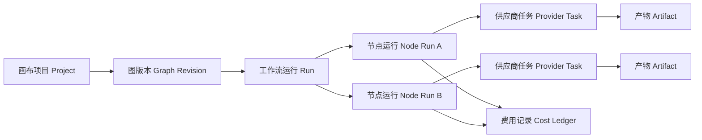

# 视频画布 V2.1 独立重构实施方案

> 日期：2026-07-16
> 范围：视频画布模块自身
> 性质：架构、产品、数据、任务与上线方案；本轮已按方案完成核心实现与验收
> 实施状态：V2 核心完成，生产发布须先备份并执行数据库迁移
> V2.1 补充：通用画布定位、多页面、场景包、逐节点 JS/Executor、持久任务和性能预算

## 一、结论与最高优先级约束

视频画布需要独立重构，不能继续把功能堆进当前 `public/js/aicanvas.js`，也不能与“新剧情广告”合并。

### 1. 两个模块必须完全独立

- 视频画布页面：`/aicanvas.html`，后续内部命名为 Video Canvas V2。
- 新剧情广告页面、接口、任务、数据和 Service 保持原状。
- 视频画布禁止调用 `/api/new-story-ad/*`。
- `src/services/videoCanvas/*` 禁止引用 `src/services/newStoryAd/*`。
- `public/js/video-canvas/*` 禁止引用 `public/js/new-story-ad/*`。
- 数据集合、任务 ID、生成 ID、文件目录、环境变量、权限、监控指标全部使用 `video_canvas` 命名空间。
- 任一模块失败、升级、回滚、删除任务，不能影响另一模块。

### 2. 只借鉴原则，不搬运业务代码

允许借鉴新剧情广告已经验证过的原则：

- 付费调用之前完成确定性校验。
- 用输入指纹判断旧结果能否复用。
- 服务端任务是唯一事实源，刷新页面可以恢复。
- 成功产物和失败任务分开保存，失败不能污染成功结果。
- 已提交供应商的任务必须保存供应商任务 ID。
- 网络断开时先查询服务器是否已经接单，禁止直接重复提交。
- 用户取消后停止后续调用并禁止晚到结果覆盖新状态。
- 区分“未提交、不计费”“已提交、计费未知”“供应商确认计费”。

禁止搬入画布的剧情广告专属内容：人物合同、商品合同、场景合同、分镜阶段、逐镜导演规则、剧情广告 QA 文案、五步向导状态、场景块算法等。

## 二、当前视频画布的主要风险

### 1. 前端单体风险

当前 `public/js/aicanvas.js` 约 1727 行，同时负责：

- Drawflow 初始化和视口控制。
- 节点定义、节点 HTML 和字段收集。
- 模板创建和自动连线。
- Agent 对话。
- 自动保存、历史记录和项目加载。
- 拓扑排序和整图运行。
- 所有图片、视频、人物、配音、音乐和合成 API 调用。
- 任务轮询、结果渲染和错误提示。

任何一个节点改动都可能影响保存、执行或其他节点，已经接近旧剧情广告曾经出现的“单文件状态互相污染”风险。

### 2. 执行风险

- “运行全部”会从头顺序执行所有节点，已有成功结果也会重跑。
- 没有运行计划、预计费用和付费确认。
- 没有服务端工作流运行任务，刷新页面会丢失进行中状态。
- 视频和数字人轮询由浏览器负责，关闭页面后缺少可靠接续。
- 人物节点一次并发生成 6 张图片，没有先确认主视图。
- 某个节点失败会停止整图，但缺少清晰的部分成功恢复入口。
- 没有幂等键；网络超时可能导致页面再次提交、供应商重复扣费。
- 没有输入指纹；无法证明旧结果仍对应当前提示词、模型和上游素材。
- 没有节点级费用账本和供应商计费状态。

### 3. 数据风险

- 当前主要保存整份 Drawflow JSON，节点配置、运行状态和产物混在一起。
- 保存使用整集合替换模式，不适合高频并发自动保存。
- 缺少图版本号和乐观锁，两个页面同时编辑时可能互相覆盖。
- 媒体 URL 嵌在节点结果里，没有独立产物生命周期和文件存在性校验。
- 内存任务在服务重启后无法恢复或正确标记中断。

### 4. 产品风险

- 节点之间只有“连上了”，没有输入/输出类型合同。
- “视频”节点实际复用 I2V，不是真正的文生视频。
- Agent 只会添加文本建议，不能安全生成并预览图修改方案。
- 模板是静态节点组合，不包含目标、门禁、预算和交付物定义。
- 页面没有统一任务中心、失败原因、费用明细和继续执行入口。

## 三、目标产品模型

视频画布 V2 由四个彼此分离的对象组成：

1. **画布项目 Project**：名称、所有者、当前图版本、偏好和权限。
2. **图版本 Graph Revision**：节点、边、坐标和配置的不可变快照。
3. **运行 Run**：用户对某个图版本提交的一次执行计划。
4. **节点运行 Node Run**：本次运行中每个节点的状态、输入指纹、产物和费用。

供应商任务和媒体产物是独立对象，不直接塞进 Graph Revision。



## 四、前端独立模块化方案

### 1. 目录结构

不再扩展 `aicanvas.js`，新增纯视频画布目录：

```text
public/js/video-canvas/
├── app.js                    # 只负责启动和依赖装配
├── api.js                    # /api/video-canvas 客户端
├── store.js                  # 单一前端状态容器
├── events.js                 # 模块内事件总线
├── graph/
│   ├── editor.js             # Drawflow 适配层
│   ├── serializer.js         # 图导入导出
│   ├── validator.js          # 前端即时校验
│   ├── dirty-tracker.js      # 脏节点及下游传播
│   ├── layout.js             # 自动布局
│   └── history.js            # 撤销重做
├── nodes/
│   ├── registry.js           # 节点注册表
│   ├── base-node.js          # 节点公共结构
│   ├── text-node.js
│   ├── image-node.js
│   ├── character-node.js
│   ├── i2v-node.js
│   ├── text-video-node.js
│   ├── voice-node.js
│   ├── music-node.js
│   └── merge-node.js
├── persistence/
│   ├── project.js            # 项目与版本保存
│   ├── autosave.js           # 防抖、乐观锁、冲突提示
│   └── local-draft.js        # IndexedDB 离线草稿
├── execution/
│   ├── planner.js            # 获取/展示服务端运行计划
│   ├── run-client.js         # 提交、取消、重试
│   ├── progress.js           # SSE/轮询恢复
│   └── result-cache.js       # 产物引用与本地显示
├── panels/
│   ├── node-library.js
│   ├── run-inspector.js
│   ├── cost-confirm.js
│   ├── task-center.js
│   ├── assets.js
│   └── agent.js
└── templates/
    ├── registry.js
    └── ecommerce.js
```

采用浏览器原生 ES Modules，不增加构建步骤。`aicanvas.html` 只保留页面骨架，并加载一个 `type="module"` 的 `app.js`。

### 2. 节点注册合同

每类节点必须声明：

- `type`、`version`、名称和分类。
- 输入端口及类型，例如 `text/plain`、`image/reference`、`video/clip`、`audio/track`。
- 输出端口及类型。
- 配置 Schema 和默认值。
- 是否付费、费用估算器和确认级别。
- 是否支持缓存、重试、取消和部分结果。
- 对应的后端 executor 名称。
- 结果渲染器，但不能在节点文件内直接调用供应商 API。

所有连线必须通过类型检查。错误连线直接阻止保存为可运行版本。

### 3. 前端状态原则

- Graph Store 只保存编辑态，不保存任务的权威状态。
- Run 和 Node Run 状态以服务端为准。
- 页面刷新后先加载 Project 和 Graph Revision，再查询未结束 Run。
- 前端不自行把节点标记为成功；必须收到服务端持久化结果。
- 自动保存失败时进入本地草稿队列，并醒目显示“尚未同步”。

## 五、后端独立架构

### 1. 路由

新增独立路由：

```text
/api/video-canvas/projects
/api/video-canvas/projects/:id
/api/video-canvas/projects/:id/revisions
/api/video-canvas/projects/:id/plan
/api/video-canvas/runs
/api/video-canvas/runs/:id
/api/video-canvas/runs/:id/cancel
/api/video-canvas/runs/:id/retry
/api/video-canvas/runs/:id/events
/api/video-canvas/node-runs/:id
/api/video-canvas/artifacts/:id
/api/video-canvas/templates
```

原 `/api/workflow` 在迁移期只服务 V1，不继续承载 V2 任务。

### 2. Service 目录

```text
src/services/videoCanvas/
├── projectService.js
├── graphRevisionService.js
├── graphValidationService.js
├── executionPlanService.js
├── runService.js
├── schedulerService.js
├── nodeRunService.js
├── providerTaskService.js
├── artifactService.js
├── costEstimateService.js
├── billingLedgerService.js
├── fingerprintService.js
├── recoveryService.js
├── cancellationService.js
├── permissionService.js
├── eventService.js
└── executors/
    ├── registry.js
    ├── textExecutor.js
    ├── imageExecutor.js
    ├── characterExecutor.js
    ├── i2vExecutor.js
    ├── textVideoExecutor.js
    ├── voiceExecutor.js
    ├── musicExecutor.js
    └── mergeExecutor.js
```

路由只做认证、参数解析和响应；业务规则必须在 Video Canvas Service 内。

### 3. 不与新剧情广告共享业务 Service

第一期宁可在 `videoCanvas` 内实现独立的任务、指纹和恢复逻辑，也不直接引用 `newStoryAd/jobService.js` 等文件。

未来如果需要消除重复，只能把完全无业务语义的能力下沉到：

```text
src/platform/jobs/
src/platform/idempotency/
src/platform/artifacts/
src/platform/billing/
```

下沉前必须满足：无剧情广告字段、无画布字段、有独立接口合同、有两套模块回归测试。此次 V2 不以公共层抽取为前置条件。

## 六、独立数据与存储模型

正式版本使用独立 SQLite 表和独立 Repository，禁止继续使用“加载整份 JSON/整集合替换”的保存方式，也禁止使用 `new_story_ad_*`。`content_records` 只能在原型阶段临时验证 Schema，进入灰度前必须迁入下述独立表：

### 1. `video_canvas_projects`

- `id`：`vcp_*`
- `user_id`
- `name`
- `status`：active / archived / deleted
- `current_revision_id`
- `settings`
- `created_at`、`updated_at`

### 2. `video_canvas_graph_revisions`

- `id`：`vcgr_*`
- `project_id`
- `revision_no`
- `base_revision_id`
- `graph_schema_version`
- `nodes`
- `edges`
- `viewport`
- `graph_fingerprint`
- `created_by`、`created_at`

Graph Revision 不可原地修改。保存产生新版本，Project 指向最新版本。

### 3. `video_canvas_runs`

- `id`：`vcr_*`
- `project_id`、`revision_id`、`user_id`
- `status`
- `plan_fingerprint`
- `idempotency_key`
- `requested_node_ids`
- `estimated_cost_min/max`
- `confirmed_cost_limit`
- `actual_cost`
- `queued_at`、`started_at`、`finished_at`
- `error_code`、`error_message`

### 4. `video_canvas_node_runs`

- `id`：`vcnr_*`
- `run_id`、`node_id`、`node_type`、`node_version`
- `status`
- `input_fingerprint`
- `reused_from_node_run_id`
- `attempt_no`
- `provider_task_id`
- `artifact_ids`
- `estimated_cost`、`actual_cost`、`billing_state`
- `error_code`、`retryable`、`error_message`
- 完整时间戳

### 5. `video_canvas_provider_tasks`

- `id`：平台内部 ID
- `node_run_id`
- `provider`、`model`
- `provider_task_id`
- `request_fingerprint`
- `submission_state`
- `provider_status`
- `billing_state`
- `request_summary`，不得保存密钥
- `last_checked_at`

### 6. `video_canvas_artifacts`

- `id`：`vca_*`
- `project_id`、`node_run_id`
- `kind`：text / image / video / audio / json
- `storage_path`、`public_url`
- `sha256`、`size`、`duration`、`width`、`height`
- `source_artifact_ids`
- `input_fingerprint`
- `status`：ready / missing / quarantined / deleted

### 7. `video_canvas_events`

保存 Run 和 Node Run 的状态变化，用于刷新恢复、问题审计和任务中心展示。

### 8. `video_canvas_cost_ledger`

- 记录估算、预授权、供应商已提交、确认计费、退款、计费未知。
- 同时接入平台全局成本统计，但画布保留自己可审计的节点级明细。
- 失败记录不能固定写 0；已提交但结果未知时必须标为 `billing_unknown`。

### 9. 并发保存

- 保存 Graph Revision 时提交 `base_revision_id`。
- 服务端发现当前版本已变化则返回 409，不允许静默覆盖。
- 前端提供“加载最新版本”“另存副本”“查看冲突”三个选择。
- 自动保存先写本地 IndexedDB，再提交服务器；成功后清理本地队列。

## 七、任务与状态机

### 1. Run 状态

```text
draft
→ planning
→ awaiting_confirmation
→ queued
→ running
→ completed
  | partially_completed
  | failed
  | cancelled
```

### 2. Node Run 状态

```text
blocked
→ ready
→ reused | queued
→ submitting
→ provider_submitted
→ provider_running
→ downloading
→ normalizing
→ qa_pending
→ succeeded
  | failed
  | cancelled
  | skipped
```

### 3. 必须持久化的状态转换

- 在调用供应商之前先持久化 `submitting` 和幂等键。
- 拿到供应商任务 ID 后立即持久化 `provider_submitted`。
- 下载完成后先登记 Artifact，再把 Node Run 标记成功。
- 任何状态转换必须写 Event。
- 服务重启后扫描非终态任务：能查询供应商的继续查询；无法证明状态的标为 `interrupted` 或 `billing_unknown`，不能自动重复提交。

### 4. 失败分类与重试

- 输入/端口/权限/余额/门禁错误：不重试。
- 供应商 429、5xx、网络暂时错误：按节点策略有限重试。
- 人物数量、缺图、提示词为空等确定性错误：修正输入后由用户重新计划。
- 已提交但响应丢失：先通过本地幂等键和供应商任务 ID查询，禁止立即重发。
- 视频失败只影响对应 Node Run；其他成功节点和产物继续保留。
- 默认自动重试上限 1 次；视频和高价节点可以设为 0。

### 5. 取消

- 取消 Run 后停止调度尚未提交的节点。
- 已提交节点尽力调用供应商取消；不支持取消时继续后台查询计费和结果，但不能覆盖已取消 Run。
- 用户可选择“取消全部”或“只取消选中节点及其下游”。

## 八、输入指纹、脏节点与复用

每个节点的输入指纹包含：

- 节点类型和版本。
- 规范化后的配置与提示词。
- 模型和供应商策略版本。
- 所有上游 Artifact 的 SHA-256。
- 影响结果的项目设置。
- Executor 版本和质量策略版本。

只有以下条件全部满足才能复用：

- 旧 Node Run 为 succeeded/reused。
- 输入指纹完全一致。
- Artifact 文件存在且校验通过。
- 当前用户对 Artifact 有权限。
- 节点策略允许复用。

节点配置或上游产物变化时，只将该节点及其下游标记为 dirty。运行全部实际含义改为“运行当前图中所有需要运行的节点”，而不是重跑全部节点。

## 九、生成前门禁与费用确认

### 1. 第一道：纯图校验，不产生费用

- 图无环。
- 连线端口类型匹配。
- 必填字段完整。
- 上游 Artifact 可用。
- 模型可用、用户有权限。
- 节点数量、视频时长和并发不超限制。

### 2. 第二道：服务端运行计划

`POST /projects/:id/plan` 返回：

- 将执行、复用、跳过、阻塞的节点。
- 每个付费节点的模型、数量、时长和费用区间。
- 预计总费用和最坏费用。
- 风险提示和不可自动重试节点。
- `plan_fingerprint` 和短时有效期。

### 3. 第三道：用户确认

- 免费运行可以直接提交。
- 含付费节点必须弹出确认面板。
- 用户确认的是具体 Plan，而不是笼统确认“运行全部”。
- 提交时服务端重新计算 Plan；指纹变化则拒绝并要求重新确认。
- 支持设置本次最高费用，调度过程中不得突破。

### 4. 人物节点止损

人物节点默认改为：

1. 先生成 1 张主视图。
2. 用户确认主视图或明确开启自动模式。
3. 再生成其余角度。
4. 某个角度失败只重试该角度。

## 十、画布 UI/UX 改造

### 1. 节点卡片

节点必须显示：

- 编辑状态：未配置 / 已就绪 / 输入已变化。
- 任务状态：排队 / 已提交 / 生成中 / 下载中 / 成功 / 失败 / 已复用。
- 上次成功时间、模型、费用和产物数量。
- “运行本节点”“运行到这里”“运行本节点及下游”。
- 失败时显示可读原因和是否可能计费。

### 2. 运行检查器

右侧新增 Run Inspector：

- 当前 Run 总进度。
- 节点依赖树和并行状态。
- 已花、预计和计费未知金额。
- 取消、重试失败节点、查看供应商任务号。
- 刷新后继续查看同一 Run。

### 3. 任务中心

视频画布拥有独立任务中心：

- 未完成、失败、已取消、已完成筛选。
- 从任务恢复到准确 Project、Revision、Run 和选中节点。
- 显示“需要确认”“可继续”“计费未知”“需要修复输入”。
- 删除 Project 与删除 Run 分开；删除前提示产物保留策略。

### 4. Agent

Agent 不直接执行付费节点。正确流程是：

1. 读取当前图和选中节点。
2. 返回结构化 Graph Patch。
3. 在画布上预览新增、删除、修改和连线。
4. 用户确认后应用图修改。
5. 仍需通过正常 Plan 和费用确认才能运行。

### 5. 电商模板

电商模板属于视频画布自己的模板，不引用剧情广告：

```text
商品素材
→ 商品分析/卖点文本
→ 详情页图片规划
→ 批量图片组
→ 用户选择图片
→ 短视频镜头规划
→ 图片转视频节点组
→ 配音/音乐
→ 合成与导出包
```

模板展开后所有节点可见、可编辑、可单独运行；不能隐藏成一个不可审计的黑盒“一键生成”。

## 十一、供应商与媒体处理

- Executor 只调用平台现有通用供应商能力或 Video Canvas 自己的 Adapter。
- 不允许浏览器直接管理供应商任务。
- 所有远程结果先落本地/对象存储，再生成 Artifact。
- 合成节点只读取 Artifact，不直接读取任意外部 URL。
- 合成前统一检测分辨率、方向、帧率、编码、时长和音轨。
- 外部 CDN 的 Drawflow 文件改为项目本地静态资源，避免网络波动导致画布不可用。

## 十二、迁移与兼容

### 1. 不做原地大爆炸替换

- V1 保持可用但冻结新增功能。
- V2 使用功能开关，仅管理员和测试账号先看到。
- 同一路径可以按用户开关加载 V1 或 V2；两边数据不混写。

### 2. V1 数据迁移

新增幂等迁移脚本：

- 备份 `workflow_db.json` 和 SQLite 相关集合。
- 每个旧 workflow 转为一个 `video_canvas_project` 和初始 Graph Revision。
- 从节点 `data.result` 中提取可验证的媒体 URL，存在的登记为 legacy Artifact。
- legacy Artifact 标记 `lineage_unverified`，可以预览但默认不可作为付费节点复用依据，除非文件校验和输入信息完整。
- 保存 `legacy_workflow_id` 映射，重复执行迁移不会重复创建。
- 旧 workflow 保留只读一段时间，验证完成后再决定下线。

### 3. 不迁移虚假的运行状态

V1 没有可靠持久化 Run，因此迁移时只迁移图和可验证产物，不伪造已完成任务、供应商任务或费用记录。

## 十三、实施批次

### 批次 0：冻结与基线（1–2 个工作日）

- 冻结 V1 新功能。
- 补充当前 V1 保存、加载、模板、节点运行和合成基线测试。
- 记录旧数据量、文件目录和接口调用图。
- 建立 V2 功能开关、权限和独立路由骨架。

验收：V1 行为有可重复基线；V2 空壳不会影响 V1 和新剧情广告。

### 批次 1：独立存储和图版本（3–4 个工作日）

- Project、Graph Revision、Artifact 数据层。
- 乐观锁、自动保存、本地草稿、版本冲突 UI。
- V1 → V2 幂等迁移脚本和 dry-run 报告。

验收：刷新、断网恢复、双页面冲突、版本回退和用户隔离通过。

### 批次 2：前端模块化（4–6 个工作日）

- 新目录、Store、Graph Adapter、Node Registry。
- 先迁移 text、image、i2v、merge 四类节点。
- 本地化 Drawflow 依赖。
- 旧 `aicanvas.js` 不再承载 V2。

验收：四类节点编辑、保存、加载、撤销、模板和类型连线完整通过。

### 批次 3：任务、计划和费用止损（5–7 个工作日）

- Run、Node Run、Provider Task、Event、Cost Ledger。
- 服务端 Plan、指纹、脏节点、结果复用和费用确认。
- 后台调度、取消、服务重启恢复、网络不确定提交恢复。

验收：关闭页面后任务继续；重开可恢复；成功节点不重复生成；未知计费不自动重试。

### 批次 4：完整节点迁移（4–6 个工作日）

- character、text-video、avatar、voice、music。
- 人物主视图确认机制。
- 产物校验、合成标准化和节点级失败恢复。

验收：所有节点有独立 Executor、Schema、费用策略和回归测试。

### 批次 5：电商模板与 Agent 图修改（3–5 个工作日）

- 电商详情页和视频模板。
- 批量分支、选择节点、交付包。
- Agent Graph Patch 预览和确认。

验收：从商品图到详情图与短视频可按节点审计、暂停、继续和复用。

### 批次 6：灰度迁移与上线（2–3 个工作日）

- 管理员 → 内部账号 → 小比例用户 → 全量。
- 每阶段比较成功率、重复提交率、单成片成本、恢复率和错误率。
- 保留一键回退 V1 的开关，V2 数据不回写 V1。

总体为约 22–33 个工程工作日；可按批次独立交付，不能为赶进度跳过批次 1 和批次 3。

## 十四、测试矩阵

### 1. 单元测试

- 图环检测、端口类型、必填项。
- Graph Fingerprint、Node Input Fingerprint。
- 脏节点传播和成功结果复用。
- Plan 指纹、费用上限和过期确认。
- 状态机非法跳转。
- 错误分类和重试策略。

### 2. 集成测试

- 新建、保存、版本冲突、恢复、归档、删除。
- Run 创建、重复提交幂等、节点并行、部分失败。
- 服务进程重启后任务恢复。
- 已提交响应丢失时不重复调用供应商。
- 取消后晚到结果不得覆盖取消状态。
- Artifact 缺失时禁止错误复用。
- 用户 A 不能访问用户 B 的项目、任务和产物。

### 3. 前端浏览器测试

- 空画布、模板、拖拽、连线、缩放、撤销重做。
- 自动保存断网与恢复。
- 费用确认、Run Inspector、任务中心。
- 刷新页面恢复进行中任务。
- 失败节点重试不影响成功节点。
- 明暗主题和常用分辨率。

### 4. 非付费供应商契约测试

- 使用 Stub Adapter 模拟成功、超时、429、5xx、重复回调、晚到回调、计费未知。
- 所有自动化首先使用 Stub，不把真实付费调用作为常规回归。

### 5. 生产最小付费验收

- 用户明确批准后，使用最低成本模型执行一条最小链路。
- 必须提前记录费用上限。
- 仅验证一次提交、一次查询、一次产物登记和一次账务记录。

## 十五、监控指标与上线门槛

必须监控：

- Run 成功率、部分成功率、恢复率、取消成功率。
- Node Run 按类型和供应商的成功率、P50/P95 时长。
- 重复提交拦截数。
- 输入门禁拦截数。
- 复用命中率和节省费用。
- `billing_unknown` 数量和处理时长。
- 单项目、单成片和单节点平均费用。
- Artifact 缺失率。
- 自动保存失败率和版本冲突率。

全量上线硬门槛：

- 不存在已知重复付费提交路径。
- 进程重启、页面刷新、断网恢复测试全部通过。
- 成功节点在输入未变化时不会重新生成。
- 每次付费执行都有可审计 Plan、确认、Provider Task 和 Cost Ledger。
- V2 操作对新剧情广告的数据、任务、页面和回归结果零影响。

## 十六、明确不做

- 不在当前 `aicanvas.js` 继续堆任务系统。
- 不把视频画布改造成剧情广告向导。
- 不调用或引用新剧情广告业务 Service。
- 不让前端成为任务状态的唯一事实源。
- 不允许“一键运行”绕过费用确认。
- 不因一个节点失败重跑整图。
- 不用真实付费生成代替自动化测试。
- 不在没有备份、迁移 dry-run 和回滚开关的情况下切换旧数据。

## 十七、最终验收清单

- [ ] 两个模块的前端目录、后端路由、Service、数据 collection 完全独立。
- [ ] 视频画布不含任何 `new-story-ad` 依赖或 API 调用。
- [ ] 新剧情广告不含任何 `video-canvas` 反向依赖。
- [ ] 项目、图版本、Run、Node Run、Provider Task、Artifact、费用均持久化。
- [ ] 运行前完成服务端校验、计划和费用确认。
- [ ] 成功结果按输入指纹复用，失败只影响失败节点及必要下游。
- [ ] 页面刷新、断网和服务重启均可恢复。
- [ ] 取消、重试和晚到结果均符合状态机。
- [ ] V1 数据可 dry-run、幂等迁移和回滚。
- [ ] 自动化回归不依赖真实付费生成。
- [ ] 灰度上线期间可独立回退 V2，不影响新剧情广告。

## 十八、V2.1 产品定位：通用画布内核 + 独立场景包

视频画布不能限定为电商广告，也不能限定为故事剧情。产品结构分成三层：

### 1. 通用画布内核 Canvas Core

只负责所有创作场景共同需要的能力：

- 项目、图版本、节点、端口、连线和布局。
- 保存、撤销、版本比较和冲突处理。
- 图校验、执行计划、任务调度和状态恢复。
- 模型选择、费用估算、授权确认和账务记录。
- 素材、产物、复用、下载和导出。
- 权限、审计、监控和错误处理。

Canvas Core 不理解“商品卖点”“故事角色”“分镜剧情”等业务含义。

### 2. 基础节点包 Core Node Pack

提供所有场景都能使用的原子节点：

- 文本输入、文本生成、结构化文本。
- 图片上传、图片生成、图片编辑、背景处理。
- 文生视频、图生视频、视频上传、视频裁剪。
- 语音、音乐、字幕、合成、导出。
- 条件、选择、批量、汇总等控制节点。

### 3. 独立场景包 Domain Packs

场景包只负责把业务能力注册到通用画布，不修改内核：

```text
public/js/video-canvas/packs/
├── ecommerce/       # 电商广告、主图、详情页、商品短视频
├── story/           # 故事剧情、角色、场景、剧情镜头
├── social-ad/       # 信息流、口播、社媒短广告
├── product-demo/    # 产品演示、功能讲解
└── blank/           # 完全自由画布
```

其中 `story` 是“画布自己的故事场景包”，不引用、不继承、不跳转新剧情广告模块。两者可以解决相似用户目标，但技术和数据完全独立。

### 4. 场景包注册合同

每个场景包必须提供独立 `manifest.js`：

```js
export default {
  id: 'ecommerce',
  version: 1,
  label: '电商广告',
  nodes: [],
  templates: [],
  validators: [],
  panels: [],
  permissions: [],
};
```

场景包只能通过注册合同接入：

- 不得修改全局变量。
- 不得直接操作其他场景包状态。
- 不得直接提交供应商任务。
- 不得绕过 Core 的 Plan、费用确认和任务系统。
- 禁用某个场景包时，其他场景包和自由画布仍可运行。

## 十九、多页面信息架构

“只有一个画布页面”无法同时承载项目、任务、素材、模板、运行监控和设置。V2 拆成七个页面，每个页面有独立职责和入口 JS。

### 页面 1：画布工作台 `/video-canvas/`

用途：进入模块后的首页。

- 新建空白画布。
- 按电商、故事、社媒、产品演示选择场景包或模板。
- 最近项目、草稿、运行中任务、失败任务。
- 最近产物和继续制作入口。

入口：`pages/dashboard.js`，不加载 Drawflow 和节点执行代码。

### 页面 2：项目编辑器 `/video-canvas/editor.html?id=...`

用途：只负责编辑图、节点和发起运行计划。

- 中央无限画布。
- 左侧节点库/模板。
- 右侧节点属性。
- 底部或右侧轻量运行摘要。
- 顶部版本、保存、预检和运行按钮。

入口：`pages/editor.js`，按当前场景包懒加载节点。

### 页面 3：任务中心 `/video-canvas/tasks.html`

用途：集中查看所有后台任务。

- 运行中、等待确认、部分完成、失败、已取消、已完成。
- 按项目、场景包、节点类型、供应商和时间筛选。
- 批量取消可取消任务。
- 快速定位计费未知、需要输入修复的任务。

入口：`pages/tasks.js`，不加载画布编辑器。

### 页面 4：运行详情 `/video-canvas/run.html?id=...`

用途：长任务的独立监控和恢复页面。

- DAG 执行图、节点状态和耗时。
- 供应商任务状态、重试次数和错误分类。
- 预计费用、实际费用、计费未知。
- 取消 Run、重试失败节点、继续下游。
- 成功产物预览和下载。

入口：`pages/run-detail.js`。

### 页面 5：素材与产物 `/video-canvas/assets.html`

用途：管理上传素材、生成产物和可复用结果。

- 商品、人物、场景、图片、视频、音频分类。
- 来源项目和节点血缘。
- 文件状态、使用次数、尺寸、时长和存储占用。
- 拖入画布、下载、归档和删除。

入口：`pages/assets.js`。

### 页面 6：模板中心 `/video-canvas/templates.html`

用途：展示所有场景包模板。

- 电商广告、故事剧情、社媒短片、产品演示和自由模板。
- 模板版本、所需模型、预计节点数和大致费用。
- 预览节点图后再创建项目。

入口：`pages/templates.js`。

### 页面 7：画布设置 `/video-canvas/settings.html`

用途：画布模块自己的设置。

- 默认模型和质量档位。
- 单次/每日预算。
- 自动重试策略。
- 默认并发和通知。
- 已启用场景包。

入口：`pages/settings.js`。

### 页面隔离验收

- 工作台和任务中心不得下载 Drawflow。
- 任务中心不得引入任何节点 UI 文件。
- 编辑器不得一次性加载全部场景包。
- 运行详情不能依赖编辑器正在打开。
- 任一页面独立刷新都能从服务端恢复。

## 二十、前端 JS 细拆规则

### 1. 哪些必须单独 JS

- 每个页面一个入口 JS。
- 每个节点类型一个独立目录或独立 JS。
- 每个场景包一个独立目录和 manifest。
- 图编辑、图校验、保存、任务、费用、素材、Agent 分别独立模块。
- 每个复杂面板一个独立 controller。
- 每个复杂节点的 Schema、View、Controller 分开。

### 2. 哪些不需要机械拆分

- 一个按钮的点击函数不单独建文件。
- 只有几行且只被一个模块使用的纯辅助函数可留在模块内。
- 同一个节点的简单字段渲染和事件绑定可以在一个文件。
- 不建立无业务含义的 `utils1.js`、`helpers2.js`。

### 3. 文件规模预算

- 页面入口：建议不超过 200 行，只负责装配。
- 普通模块：建议不超过 350 行。
- 单节点模块：建议不超过 300 行。
- 超过 400 行必须评审是否拆成 schema/view/controller/service。
- 禁止再次出现 1000 行以上的画布业务 JS。

通过 CI 脚本 `scripts/check-video-canvas-boundaries.js` 检查：

- 文件行数预算。
- 禁止依赖目录。
- 场景包跨包引用。
- 前端直接调用供应商接口。
- `video-canvas` 与 `new-story-ad` 双向引用。

### 4. 完整前端目录

```text
public/video-canvas/
├── index.html
├── editor.html
├── tasks.html
├── run.html
├── assets.html
├── templates.html
└── settings.html

public/js/video-canvas/
├── pages/
│   ├── dashboard.js
│   ├── editor.js
│   ├── tasks.js
│   ├── run-detail.js
│   ├── assets.js
│   ├── templates.js
│   └── settings.js
├── core/
│   ├── api-client.js
│   ├── auth-context.js
│   ├── event-bus.js
│   ├── router.js
│   ├── store.js
│   ├── errors.js
│   └── feature-flags.js
├── graph/
│   ├── editor-adapter.js
│   ├── node-registry.js
│   ├── port-types.js
│   ├── validator.js
│   ├── serializer.js
│   ├── fingerprint.js
│   ├── dirty-tracker.js
│   ├── layout.js
│   ├── selection.js
│   └── history.js
├── persistence/
│   ├── project-client.js
│   ├── revision-client.js
│   ├── autosave.js
│   ├── conflict-resolver.js
│   └── local-draft.js
├── execution/
│   ├── preflight.js
│   ├── plan-client.js
│   ├── run-client.js
│   ├── event-stream.js
│   ├── run-recovery.js
│   └── result-cache.js
├── panels/
│   ├── node-library.js
│   ├── property-panel.js
│   ├── plan-panel.js
│   ├── cost-confirmation.js
│   ├── run-summary.js
│   ├── version-panel.js
│   └── agent-panel.js
├── nodes/
│   ├── text-input/
│   ├── text-generate/
│   ├── structured-text/
│   ├── image-upload/
│   ├── image-generate/
│   ├── image-edit/
│   ├── background/
│   ├── character/
│   ├── text-to-video/
│   ├── image-to-video/
│   ├── video-upload/
│   ├── video-trim/
│   ├── voice/
│   ├── music/
│   ├── subtitle/
│   ├── merge/
│   ├── condition/
│   ├── batch/
│   └── select/
├── packs/
│   ├── ecommerce/
│   ├── story/
│   ├── social-ad/
│   ├── product-demo/
│   └── blank/
└── components/
    ├── modal.js
    ├── toast.js
    ├── media-preview.js
    ├── status-chip.js
    └── cost-badge.js
```

每个复杂节点目录标准结构：

```text
nodes/image-to-video/
├── manifest.js       # 类型、版本、端口、费用和能力声明
├── schema.js         # 配置字段和校验
├── view.js           # 节点卡片与结果展示
├── controller.js     # 前端交互，不调用供应商
└── migrations.js     # 节点版本升级
```

## 二十一、场景包逐项拆分

### 1. 电商广告包 `packs/ecommerce`

独立节点：

- 商品素材。
- 商品主体提取。
- 商品信息/卖点分析。
- 主图规划。
- 详情页图片规划。
- 批量商品图。
- 商品场景合成。
- 模特试穿/持物。
- 电商镜头规划。
- 商品视频片段。
- 电商字幕与价格标签。
- 电商交付包。

独立模板：主图套图、详情页、15 秒商品广告、30 秒产品介绍、跨境电商竖屏广告。

### 2. 故事剧情包 `packs/story`

独立节点：

- 故事想法。
- 故事大纲。
- 角色设定。
- 场景设定。
- 剧情段落。
- 故事镜头表。
- 镜头画面。
- 故事视频片段。
- 角色配音。
- 环境音与音乐。
- 剧情合成。

该场景包只借鉴“先校验再生成、成功结果复用”的原则，不使用新剧情广告的任务、合同、阶段或数据。

### 3. 社媒广告包 `packs/social-ad`

- 营销目标。
- 受众和平台规格。
- 钩子文案。
- 口播脚本。
- 信息流镜头。
- CTA 和字幕样式。
- 多比例导出。

### 4. 产品演示包 `packs/product-demo`

- 功能清单。
- 操作步骤。
- 屏幕素材。
- 演示脚本。
- 高亮区域。
- 解说配音。
- 产品演示合成。

## 二十二、后端服务和 Worker 细拆

### 1. API 进程只负责

- 鉴权和权限。
- Project/Revision CRUD。
- 预检、Plan 和费用确认。
- 创建 Run、查询状态和发送事件。
- 不在 HTTP 请求生命周期内等待图片或视频生成完成。

### 2. 独立 Worker 进程

新增 PM2 进程 `vido-canvas-worker`：

- 从持久任务表领取 Node Run。
- 执行供应商提交和查询。
- 下载、校验和登记 Artifact。
- 执行本地 FFmpeg 合成。
- 写状态事件和费用记录。
- 进程崩溃后通过租约恢复任务。

API 服务重启不能中断 Worker；Worker 重启不能丢失数据库中的任务。

### 3. 后端目录进一步拆分

```text
src/routes/videoCanvas/
├── projects.js
├── revisions.js
├── plans.js
├── runs.js
├── nodeRuns.js
├── artifacts.js
├── templates.js
├── settings.js
└── index.js

src/services/videoCanvas/
├── projects/
├── graph/
├── planning/
├── runs/
├── scheduling/
├── providers/
├── artifacts/
├── billing/
├── events/
├── recovery/
├── templates/
└── domainPacks/

src/workers/videoCanvas/
├── worker.js
├── leaseManager.js
├── dispatcher.js
├── providerWatcher.js
├── artifactFinalizer.js
├── recoveryScanner.js
└── executors/
```

### 4. 每个节点必须有独立 Executor

前端节点只声明参数；后端 Executor 才能执行：

```text
executors/
├── textGenerateExecutor.js
├── imageGenerateExecutor.js
├── imageEditExecutor.js
├── characterExecutor.js
├── textToVideoExecutor.js
├── imageToVideoExecutor.js
├── voiceExecutor.js
├── musicExecutor.js
├── subtitleExecutor.js
└── mergeExecutor.js
```

Executor 必须实现统一接口：

- `validateInput`
- `estimateCost`
- `buildRequestFingerprint`
- `submit`
- `poll` 或 `handleWebhook`
- `cancel`
- `normalizeResult`
- `classifyError`
- `supportsReuse`

## 二十三、任务存储进一步细化

### 1. 专用 SQLite 表

```text
video_canvas_projects
video_canvas_graph_revisions
video_canvas_runs
video_canvas_node_runs
video_canvas_node_attempts
video_canvas_provider_tasks
video_canvas_artifacts
video_canvas_artifact_links
video_canvas_events
video_canvas_cost_ledger
video_canvas_idempotency_keys
video_canvas_worker_leases
video_canvas_settings
```

### 2. 为什么 Node Run 和 Attempt 分开

- Node Run 表示本次 Run 对一个节点的最终业务结果。
- Attempt 表示每次真实尝试，包含是否提交供应商、任务号、错误和费用。
- 重试只新增 Attempt，不覆盖历史。
- 可以准确看到“第一次超时但可能计费，第二次成功”的真实成本。

### 3. Worker 租约

- Worker 原子领取任务并写 `lease_owner`、`lease_expires_at`。
- 正常执行期间定时续租。
- Worker 崩溃后，Recovery Scanner 只回收过期租约。
- 已有 Provider Task ID 的 Attempt 进入查询恢复，不能重新 submit。
- 没有提交证据的 Attempt 才允许回到 queued。

### 4. 关键索引

- Project：`user_id + updated_at`。
- Run：`project_id + created_at`、`status + queued_at`。
- Node Run：`run_id + node_id` 唯一索引、`status + priority`。
- Provider Task：`provider + provider_task_id` 唯一索引。
- Attempt：`node_run_id + attempt_no` 唯一索引。
- Artifact：`sha256`、`project_id + created_at`。
- Event：`run_id + sequence_no` 唯一索引。
- Idempotency：`user_id + idempotency_key` 唯一索引。

### 5. 事务边界

- 创建 Run、Node Runs 和首批 queued 节点必须在一个事务。
- Provider Task ID 与 `provider_submitted` 状态必须在一个事务。
- Artifact 登记、Node Run 成功和下游解锁必须在一个事务。
- 费用状态变更和 Attempt 状态必须一致提交。

## 二十四、生成速度与吞吐方案

速度目标不是让供应商模型凭空变快，而是减少串行等待、重复生成、无效轮询和页面阻塞。

### 1. DAG 并行调度

- 没有依赖关系的节点并行运行。
- 同一批图片节点可以批量提交。
- 下游只等待自己需要的上游，不等待整张图。
- 某条分支失败不阻塞无依赖分支。

### 2. 分资源并发池

初始建议值，最终可配置：

- LLM：每用户 4–6 个并发。
- 图片：每用户 2–3 个并发。
- 视频：每用户 1–2 个并发。
- 下载/转码：每 Worker 2 个并发。
- FFmpeg 合成：根据 CPU 和内存单独限流。

同时设置供应商全局限流，避免多个用户一起触发 429。

### 3. 两档生成

- 预览档：低分辨率、短时长、低成本，用于构图和流程确认。
- 成片档：仅对用户选中的节点或分支使用高质量模型。
- 预览 Artifact 与成片 Artifact 分开保存，不能把预览误当成最终结果。

### 4. 结果复用

- 输入指纹相同直接复用。
- 相同上传素材按 SHA-256 去重。
- 相同模型请求在允许范围内命中节点缓存。
- 转码后的标准化素材可复用，避免每次合成都重新转码。

### 5. 事件推送

- 使用 SSE 推送 Run Event，不让每个节点每 3 秒单独轮询。
- 页面断线后携带最后 `sequence_no` 接续事件。
- Provider Watcher 在服务端使用自适应查询间隔。
- 支持 Webhook 的供应商优先 Webhook，轮询作为补偿。

### 6. 前端加载速度

- 工作台不加载编辑器。
- 编辑器只加载当前场景包和画布中已存在的节点模块。
- 媒体列表使用缩略图、分页和虚拟滚动。
- 大 Graph 的指纹、拓扑和布局计算移到 Web Worker。
- 图版本按需加载，不一次下载所有历史版本和任务详情。

### 7. 性能预算

- 工作台可交互：本地/内网 P95 小于 1.5 秒。
- 编辑器空画布可交互：P95 小于 2 秒。
- 200 节点图加载：P95 小于 3 秒。
- 自动保存服务端响应：P95 小于 500ms。
- 创建 Run 返回：P95 小于 500ms，不等待生成完成。
- Run 状态事件延迟：P95 小于 2 秒。
- 调度器从 ready 到领取：P95 小于 1 秒。
- 平台额外编排耗时：不超过供应商总生成时间的 5%。

## 二十五、更加细化的开发 WBS

### A. 产品和交互基线

- A01 定义七个页面的导航和权限。
- A02 定义 Project、Revision、Run、Node Run 用户术语。
- A03 绘制编辑、计划确认、运行监控、失败恢复流程。
- A04 定义电商、故事、社媒、产品演示场景包边界。
- A05 定义移动端只读/监控能力，编辑器优先桌面端。

### B. 数据基础

- B01 新增专用数据库 migration。
- B02 Project Repository。
- B03 Graph Revision Repository 和乐观锁。
- B04 Run/Node Run/Attempt Repository。
- B05 Provider Task 和 Idempotency Repository。
- B06 Artifact 和 Artifact Link Repository。
- B07 Event 与 Cost Ledger Repository。
- B08 数据备份、导出和清理策略。

### C. 通用画布内核

- C01 Node Registry 和场景包 Registry。
- C02 端口类型系统。
- C03 Graph Schema 和版本迁移。
- C04 Graph Validator。
- C05 Graph Fingerprint 和 Node Input Fingerprint。
- C06 Dirty Tracker。
- C07 撤销重做和版本比较。
- C08 本地草稿和自动保存。
- C09 Drawflow 本地化和 Editor Adapter。

### D. 任务平台

- D01 Plan Service。
- D02 Cost Estimate 和费用上限。
- D03 Run 创建事务。
- D04 Scheduler 和依赖解锁。
- D05 Worker Lease。
- D06 Provider Submit/Watch。
- D07 Artifact Finalizer。
- D08 Cancellation。
- D09 Recovery Scanner。
- D10 SSE Event Stream。
- D11 失败分类和重试策略。
- D12 账务未知和退款/冲正记录。

### E. 多页面前端

- E01 工作台。
- E02 编辑器框架。
- E03 节点属性面板。
- E04 Plan 与费用确认。
- E05 任务中心。
- E06 Run 详情。
- E07 素材与产物库。
- E08 模板中心。
- E09 设置页面。
- E10 页面级权限、空态、错误态和加载态。

### F. 基础节点

- F01 Text Input。
- F02 Text Generate。
- F03 Structured Text。
- F04 Image Upload。
- F05 Image Generate。
- F06 Image Edit。
- F07 Character。
- F08 Text to Video。
- F09 Image to Video。
- F10 Video Upload/Trim。
- F11 Voice。
- F12 Music。
- F13 Subtitle。
- F14 Merge/Export。
- F15 Batch/Select/Condition。

### G. 场景包

- G01 空白自由画布。
- G02 电商广告包第一版。
- G03 故事剧情包第一版。
- G04 社媒广告包第一版。
- G05 产品演示包第一版。
- G06 每个场景包至少两套模板和独立测试。

### H. 迁移和上线

- H01 V1 数据分析 dry-run。
- H02 幂等迁移脚本。
- H03 Legacy Artifact 校验。
- H04 管理员灰度。
- H05 内部账号灰度。
- H06 小比例生产灰度。
- H07 指标门禁和自动停止放量。
- H08 V1 只读期和最终下线决策。

## 二十六、V2.1 新增硬验收

- [ ] 至少七个页面职责分开，编辑器不承担完整任务中心和素材管理。
- [ ] Canvas Core 不包含电商、故事或新剧情广告业务字段。
- [ ] 电商、故事等场景包可分别启停且互不引用。
- [ ] 故事场景包与新剧情广告前后端零依赖、数据零共用。
- [ ] 每个页面有独立入口 JS。
- [ ] 每种可执行节点有独立前端模块和独立后端 Executor。
- [ ] CI 能阻止大文件、跨场景包引用和两产品模块互相依赖。
- [ ] API 与 Canvas Worker 分进程运行，任务不依赖页面或单次 HTTP 请求存活。
- [ ] Node Run、Attempt、Provider Task 和费用记录可完整审计。
- [ ] 200 节点图和并行分支达到性能预算。
- [ ] 预览档与成片档分开，成功产物可复用。
- [ ] 任一节点失败不会让无依赖成功分支重跑。
