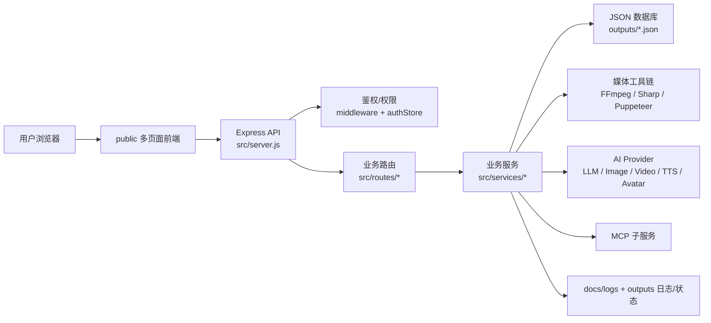
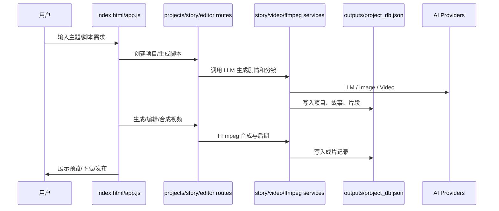
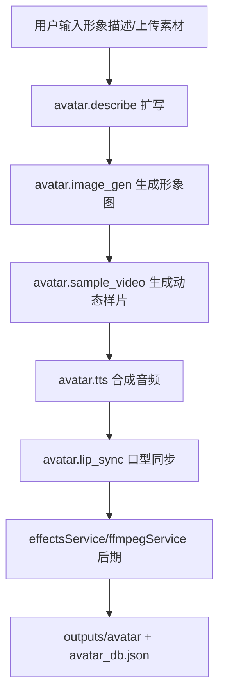
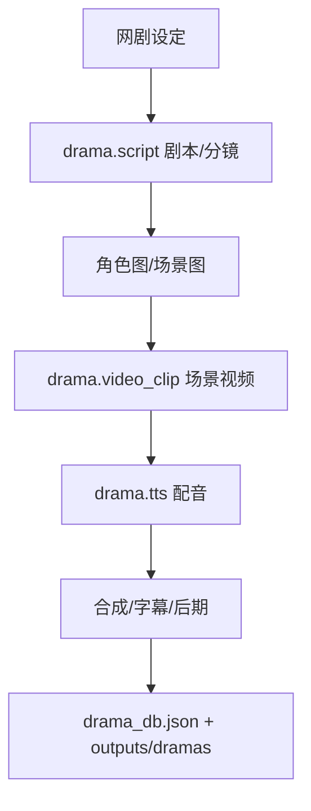
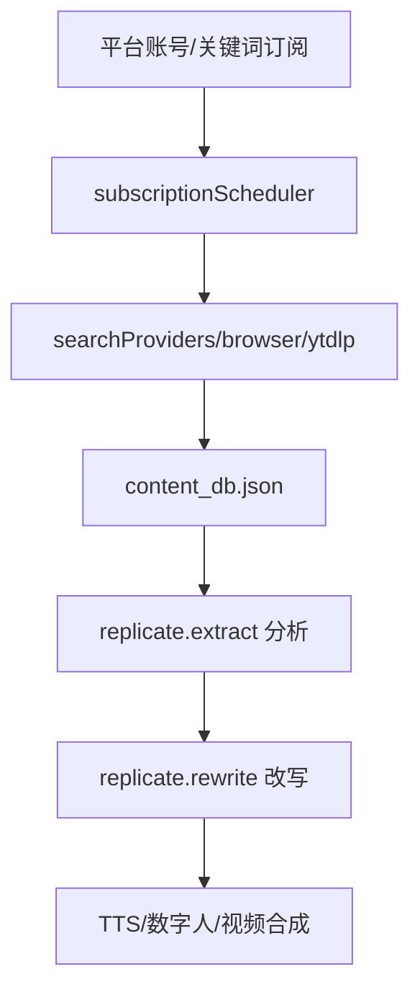

# VIDO 项目整体架构

> 生成日期：2026-04-30  
> 项目：VIDO AI 视频生成平台  
> 本地入口：http://localhost:3007  
> 后端入口：`src/server.js`

## 1. 项目定位

VIDO 是一个以 AI 视频创作为核心的本地/生产一体化平台，覆盖从选题、脚本、分镜、图片、视频、配音、数字人、后期合成到发布与运营监控的完整链路。

当前项目形态是：

- 后端：Express.js 单体服务
- 前端：原生 HTML/CSS/JavaScript，多页面应用
- 数据：`outputs/*.json` 文件型数据库
- 媒体处理：FFmpeg / Sharp / Puppeteer / yt-dlp 等本地工具链
- AI 能力：通过可配置 provider + pipeline stage 调度多家模型供应商
- 运维：脚本化部署、SFTP 同步、PM2 生产运行

## 2. 目录总览

```text
D:\VIDO
├── src/                         # 后端主代码
│   ├── server.js                # Express 入口、路由挂载、启动任务
│   ├── middleware/              # 鉴权、OpenAPI 签名、积分等中间件
│   ├── models/                  # JSON 数据访问层
│   ├── routes/                  # API 路由层
│   ├── services/                # 业务服务、AI 调用、媒体处理、调度器
│   └── utils/                   # 通用工具
├── public/                      # 前端页面与静态资源
│   ├── *.html                   # 多页面入口
│   ├── js/                      # 页面脚本
│   ├── css/                     # 页面样式
│   └── fonts/                   # 字幕/中文字体等
├── outputs/                     # JSON 数据库与生成产物
├── scripts/                     # 部署、诊断、迁移、生产探测脚本
├── docs/
│   ├── logs/                    # 统一日志系统
│   └── reports/                 # 架构、分析、产品报告
├── MCP/                         # MCP 服务/插件相关代码
├── node_modules/                # Node 依赖
├── package.json                 # 项目依赖和启动脚本
└── AGENTS.md                    # 项目助理与日志协议
```

## 3. 运行时架构



### 启动流程

1. `node src/server.js` 读取 `.env`。
2. 初始化 `authStore`，首次运行会创建默认管理员。
3. 注册公开静态资源、公开 API、鉴权 API、权限 API、OpenAPI。
4. 启动订阅调度器 `subscriptionScheduler`。
5. 监听端口，当前项目约定端口为 `3007`。
6. 启动 MCP 管理器 `mcpManager.startAll()`。
7. 注册每日 00:00 学习任务 `dailyLearnService.scheduleDaily(0, 0)`。

## 4. 后端分层

### 4.1 入口层：`src/server.js`

职责：

- Express 应用初始化
- CORS、JSON body、cookie 解析
- 静态资源托管
- 公开媒体文件流式输出
- API 路由挂载
- 权限门禁
- 健康检查 `/api/health`
- MCP 与每日学习任务启动

### 4.2 中间件层：`src/middleware/`

| 文件 | 职责 |
|---|---|
| `auth.js` | 登录态校验、角色校验、权限校验 |
| `apiAuth.js` | OpenAPI AppID/AppKey 签名校验 |
| `credits.js` | 积分/额度相关校验 |
| `streamAuth.js` | 媒体流访问鉴权 |

### 4.3 数据层：`src/models/`

| 文件 | 职责 |
|---|---|
| `authStore.js` | 用户、角色、权限、refresh token、积分日志 |
| `database.js` | 多模块 JSON 数据库统一 CRUD |
| `editStore.js` | 编辑器相关数据 |

数据层不是传统 SQL 数据库，而是按业务模块拆成 `outputs/*.json`。`database.js` 内部通过 `createStore(fileName, tableName)` 生成轻量 CRUD，并保留对旧 `vido_db.json` 的迁移兼容逻辑。

### 4.4 路由层：`src/routes/`

路由按业务域拆分，典型模块如下：

| 路由 | 功能域 |
|---|---|
| `auth.js` | 登录、注册、刷新 token、当前用户 |
| `admin.js` | 后台 dashboard、用户/角色、统计、KB 管理 |
| `settings.js` | AI provider、模型、pipeline 配置 |
| `projects.js` | 视频项目管理 |
| `story.js` | 剧情/脚本生成 |
| `i2v.js` | 图生视频 |
| `avatar.js` | 数字人形象、口型同步、样片 |
| `digitalHuman.js` | 数字人作品库、声音克隆、视频任务 |
| `drama.js` | 网剧项目、剧集、场景视频 |
| `comic.js` | 漫画生成 |
| `imggen.js` | AI 图片生成 |
| `novel.js` | AI 小说 |
| `workflow.js` | 工作流工具 |
| `publish.js` | 社媒发布 |
| `radar.js` | 内容雷达/账号监控 |
| `browser.js` | 浏览器自动化/平台绑定 |
| `openapi.js` | 对外开放接口 |
| `mcp.js` | MCP 管理 |
| `aiTeam.js` / `agent.js` | AI 团队与 agent 调用 |

### 4.5 服务层：`src/services/`

服务层承载主要业务逻辑，可分为几组：

| 类型 | 代表文件 | 说明 |
|---|---|---|
| 内容生成 | `storyService.js`, `novelService.js`, `dramaService.js`, `comicService.js` | LLM 脚本、剧情、小说、漫画等 |
| 图片/视频 | `imageService.js`, `videoService.js`, `motionService.js`, `soraService.js`, `wanAnimateService.js` | 图片、视频、动效、不同模型封装 |
| 数字人 | `avatarService.js`, `jimengAvatarService.js`, `hiflyService.js`, `portraitService.js` | 形象生成、口型同步、数字人任务 |
| 语音/音乐 | `ttsService.js`, `aliyunVoiceService.js`, `voiceLibrary.js`, `musicService.js` | TTS、声音库、音乐 |
| 后期处理 | `ffmpegService.js`, `effectsService.js`, `editService.js`, `videoMattingPipeline.js` | 合成、字幕、抠像、剪辑 |
| 平台配置 | `settingsService.js`, `pipelineModelService.js`, `tokenTracker.js` | 供应商、模型链路、成本统计 |
| 知识库 | `knowledgeBaseService.js`, `knowledgeBaseSeed.js`, `knowledgeSources.js` | KB 检索、seed、来源管理 |
| 运营/自动化 | `radarService.js`, `publishService.js`, `syncService.js`, `subscriptionScheduler.js` | 监控、发布、同步、订阅 |
| Agent/MCP | `aiTeamService.js`, `agentOrchestrator.js`, `mcpManager.js`, `dailyLearnService.js` | AI 团队、编排、MCP、每日学习 |

## 5. 前端架构

前端是原生多页面应用，不依赖 React/Vue 构建链。页面由 `public/*.html` 直接提供，逻辑在 `public/js/*.js`，样式在 `public/css/*.css`。

| 页面 | 主要脚本 | 功能 |
|---|---|---|
| `home.html` | `home.js` | 公开首页/登录入口 |
| `index.html` | `app.js` | 主工作台，项目创作核心入口 |
| `admin.html` | `admin.js`, `admin-api-accounts.js` | 管理后台、AI 配置、统计、KB |
| `digital-human.html` | `digital-human.js` | 数字人工作台 |
| `workflow.html` | `workflow.js` | 工作流工具 |
| `editor.html` | `editor.js` | 视频/素材编辑器 |
| `drama-studio.html` | `drama-studio.js` | 网剧工作室 |
| `aicanvas.html` | `aicanvas.js` | AI 画布 |
| `clone-prototype.html` | 独立脚本 | 爆款/克隆原型 |
| `api-docs.html` | 页面内逻辑 | OpenAPI 文档 |

通用鉴权逻辑集中在 `public/js/auth.js`，负责 token 存取、刷新、用户态判断和路由保护。

## 6. 数据与产物

核心数据都在 `outputs/`：

| 文件 | 说明 |
|---|---|
| `auth_db.json` | 用户、角色、权限、refresh token |
| `settings.json` | AI provider、模型、API 配置 |
| `pipeline_model_config.json` | 各业务 stage 的模型优先级链路 |
| `project_db.json` | 项目、故事、视频片段、成片 |
| `avatar_db.json` | 数字人任务 |
| `portrait_db.json` | 形象库 |
| `i2v_db.json` | 图生视频任务 |
| `drama_db.json` | 网剧项目与剧集 |
| `comic_db.json` | 漫画任务 |
| `novel_db.json` | 小说 |
| `knowledge_base.json` | 知识库文档 |
| `token_usage.json` | LLM/图片/视频/TTS 调用与成本埋点 |
| `workflow_db.json` | 工作流数据 |
| `monitor_db.json` / `content_db.json` | 内容雷达监控与内容库 |
| `voice_db.json` | 自定义声音 |

媒体产物也写入 `outputs/` 的子目录，例如：

- `outputs/projects/`
- `outputs/avatar/`
- `outputs/portraits/`
- `outputs/dramas/`
- `outputs/comics/`
- `outputs/music/`
- `outputs/assets/`
- `outputs/jimeng-assets/`

## 7. 权限模型

VIDO 有两层角色体系：

- 平台角色：后台管理端，内置 `admin`
- 企业角色：用户端，内置 `user`

权限字符串格式：

```text
platform:{module}:{action}
enterprise:{module}:{action}
*
```

典型访问规则：

- `/api/auth`：公开
- `/api/health`：公开
- `/api/settings`、`/api/admin`、`/api/mcp`、`/api/sync`：需要 admin
- `/api/i2v`、`/api/avatar`、`/api/dh`、`/api/imggen`、`/api/novel`、`/api/comic`、`/api/portrait`：需要登录和对应权限
- `/openapi`：使用 AppID/AppKey 签名认证

## 8. AI Provider 与模型链路

VIDO 的 AI 配置分两层：

### Provider 层

由 `settingsService.js` 管理，配置文件为：

```text
outputs/settings.json
```

支持 OpenAI、DeepSeek、智谱、通义、Anthropic、Replicate、Fal、Runway、Luma、Vidu、MiniMax、Kling、即梦、Seedance、Veo、阿里 TTS、火山 TTS、讯飞、Hedra、D-ID、HeyGen、Hifly、DeyunAI、MXAPI 等。

### Pipeline Stage 层

由 `pipelineModelService.js` 管理，配置文件为：

```text
outputs/pipeline_model_config.json
```

核心思想是把业务流程拆成 stage，每个 stage 可以配置多个候选模型，按优先级 fallback。

典型 stage：

- `avatar.describe`
- `avatar.image_gen`
- `avatar.sample_video`
- `avatar.lip_sync`
- `avatar.tts`
- `drama.script`
- `drama.character_image`
- `drama.scene_image`
- `drama.video_clip`
- `replicate.extract`
- `replicate.rewrite`
- `story.generate`
- `imggen.t2i`
- `imggen.i2v`

## 9. 核心业务链路

### 9.1 普通视频创作



### 9.2 数字人链路



### 9.3 网剧链路



### 9.4 内容雷达与复刻链路



## 10. 知识库与每日学习

知识库：

- 主数据：`outputs/knowledge_base.json`
- 服务：`knowledgeBaseService.js`
- seed：`knowledgeBaseSeed.js` 与 `src/services/seeds/*`
- 使用场景：故事、数字人、网剧、分镜、氛围、工程规范等

每日学习：

- 服务：`dailyLearnService.js`
- 每日 00:00 触发
- 输出到：`docs/logs/learning/YYYY-MM-DD/`
- 会话与变更日志输出到：`docs/logs/sessions/`、`docs/logs/changes/`

## 11. 运维与部署

本地：

```bash
node src/server.js
```

或：

```bash
npm start
```

生产：

- 服务器：`119.29.128.12:4600` 或近期日志中的 `43.98.167.151`
- PM2 进程名：`vido`
- 常用部署脚本：`scripts/deploy-*.js`
- KB 部署脚本：`scripts/deploy-kb.js`
- 生产/本地同步脚本：`scripts/pull-server-files.js`、`scripts/probe-server-*.js`

生产部署大体流程：

1. 本地确认改动。
2. 部署脚本通过 SSH/SFTP 上传指定文件。
3. 远端执行 `pm2 reload vido`。
4. 调用 `/api/health` 和关键 API 验证。
5. 写入 `docs/logs/deployments/YYYY-MM-DD.md`。

## 12. 当前状态快照

截至本次检查：

- 本地 3007 端口已有 Node 进程监听。
- 项目没有构建步骤，修改后通常重启 Node 即可生效。
- 代码树存在较多历史备份文件与未提交改动，本架构文档没有整理或删除这些文件。
- 最近日志显示，重点变更集中在数字人口型同步、模型路由、Token 成本埋点、Hifly fallback、生产同步和 KB 强制注入。

## 13. 主要风险与建议

### 13.1 JSON 文件数据库并发风险

当前数据写入多为同步读写 JSON 文件。优点是简单直接，缺点是并发写入时可能出现覆盖风险。随着任务量增加，建议逐步迁移关键表到 SQLite/PostgreSQL，至少优先迁移：

- `auth_db.json`
- `project_db.json`
- `avatar_db.json`
- `token_usage.json`
- `workflow_db.json`

### 13.2 业务脚本和生产脚本较多

`scripts/` 中部署、诊断、迁移脚本数量很多，建议后续整理为：

- `scripts/deploy/`
- `scripts/prod/`
- `scripts/diag/`
- `scripts/migration/`
- `scripts/dev/`

### 13.3 备份文件散落在代码目录

`public/`、`src/routes/`、`src/services/` 下存在大量 `.bak.*` 文件。建议统一移动到 `docs/archive/` 或 `_backup/`，避免搜索和维护时干扰。

### 13.4 AI 调用成本需要持续校准

`tokenTracker.js` 已经负责成本埋点，但不同供应商价格和计费口径会变。建议给 provider/model 增加后台可编辑的价格配置，减少硬编码。

### 13.5 服务启动时任务较多

`server.js` 启动时会初始化 auth、MCP、每日学习、订阅调度等。建议后续把启动任务拆出 `src/bootstrap/`，并给每项任务加超时和状态页，便于排查启动慢或健康检查超时。

## 14. 后续架构演进路线

短期：

- 整理脚本目录和备份文件。
- 给 `/api/health` 增加更细的 readiness 信息。
- 给关键 JSON 写入增加文件锁或写入队列。
- 补一份 API 路由索引文档。

中期：

- 把核心数据迁移到 SQLite/PostgreSQL。
- 把媒体任务抽成任务队列，支持重试、取消、进度追踪。
- 把 provider 价格、限流、fallback 策略全部后台可配置。
- 将数字人、网剧、复刻、普通视频的 pipeline 统一成可视化工作流。

长期：

- 前端从巨型原生 JS 文件拆成模块化构建。
- 后端拆出任务 worker 与 API server。
- 生产部署改为标准 CI/CD。
- 建立多租户隔离、审计日志、成本预算和模型调用 SLA。
